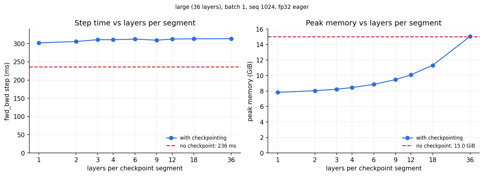

训练一步 Transformer，GPU 的时间和显存花在了哪里？一个 op 在 GPU 上只做两件事：在计算单元上**算**（FLOPs），在显存和计算单元之间**搬**（bytes）。这篇先用这两件事搭出 roofline 这把尺子，再在一张 RTX 5090 上把一步训练拆开实测。几条线最后都指向同一个东西——attention 的 seq × seq 分数矩阵，这也是下一篇 [FlashAttention 1–4](/blog/flashattention-1-to-4/) 的出发点。

> 环境：RTX 5090 32 GB，torch 2.11.0+cu130；模型是自己写的 Transformer LM（RMSNorm + RoPE + SwiGLU，pre-norm）。fp32 基准关掉 tf32（`allow_tf32=False`）；除注明外 batch 4、seq 512，预热 5 步、计时 10 步；显存一律 GiB = 2³⁰ B（`max_memory_allocated() / 1024³`）。

## 省流不看 {#tldr}

1. **速度上限看 roofline：耗时 ≥ max(FLOPs / 峰值算力, bytes / 带宽)**（[§1](#basics)）：5090 带宽 1.79e12 B/s，fp32 / bf16 / fp8 / nvfp4 峰值 1.05e14 / 2.1e14 / 4.19e14 / 1.68e15 FLOPS，ridge point 58 / 117 / 234 / 935 FLOPs/B；算术强度低于 ridge 的 op 受带宽限制，快慢和 FLOPs 无关。
2. **训练一步 ≈ 6 × 参数量 × token 数 FLOPs**（[§2](#fwd-bwd)）：前向每个参数做一次乘加（2N），反向对输入、对权重各做一次同样大的矩阵乘（4N）；实测反向 ≈ 2.0× 前向，整步只跑到 fp32 峰值的 31%。
3. **attention 是 memory-bound 的**（[§3](#memory-bound)）：softmax 的 FLOPs 只有 PV 矩阵乘的 1/5，耗时却是它的 6×——eager 下 5 个 kernel 把 seq² 大小的分数矩阵进出显存 8 次。
4. **显存峰值 = 🟦 权重 + max(🟩 activation, 🟥 梯度)**（[§4](#peak-memory)）：每个 op 的局部偏导里有什么，前向就得存什么；一层 activation 的一半以上是 attention 的 S、P，3.41B 的 xl 在 seq 2048 时第 2 层就 OOM。
5. **bf16、checkpoint 都只能缓解**（[§5](#bf16-checkpoint)）：bf16 快 ~2×、省 ~20%；checkpoint 用多算一遍前向（+30%）换显存减半，但 S、P 重算时照样落显存——根治要改 kernel，见 [FlashAttention 1–4](/blog/flashattention-1-to-4/)。

---

## 1 基础概念：FLOPs、算术强度、roofline、MFU {#basics}

### 1.1 FLOPs 与 FLOPS {#flops}

- **FLOPs**（floating-point operations）是浮点运算的**次数**，**FLOPS**（per second）是**速率**。本文都用 10 的幂写：seq 1024 的一次 PV 矩阵乘是 8.6e9 FLOPs，5090 的 fp32 峰值是 1.05e14 FLOPS。
- **矩阵乘** `[M, K] × [K, N]`：M·N 个输出，每个做 K 次乘加，一次乘加记 2 FLOPs，共 **2·M·N·K**。
- **逐元素 op**（加、乘、exp、mask）：每个元素一到几十次运算（exp 按 ~20 次计），总量 = 元素数 × 每元素次数，比同尺寸的矩阵乘少几个数量级。

FLOPs 只是一半的账：每个 op 还得把输入从显存读进来、把输出写回去，这部分按字节算。

### 1.2 算术强度与 roofline {#roofline}

算和搬各有上限——峰值算力 P 和显存带宽 B，所以一个 op 的耗时有两个下限，取较大的那个：

<p align="center">$t \ge \max\left(\dfrac{\mathrm{FLOPs}}{P},\ \dfrac{\mathrm{bytes}}{B}\right)$</p>

两者之比是 op 自身的属性，叫**算术强度**（arithmetic intensity）$I = \mathrm{FLOPs} / \mathrm{bytes}$，即每搬 1 字节做几次运算。把上式改写成「最快能跑多少 FLOPS」，就是 **roofline 模型**：

<p align="center">$\mathrm{FLOPS}_{\max}(I) = \min(P,\ I \cdot B)$</p>

在 log-log 坐标上，它是一条斜线（带宽）接一条平线（算力），拐点 $I^* = P / B$ 叫 **ridge point**：

- $I < I^*$：**memory-bound**。落在斜线下，耗时 ≈ bytes / B，和 FLOPs 无关；想更快只能少搬字节。
- $I > I^*$：**compute-bound**。落在平线下，耗时 ≈ FLOPs / P；想更快只能少算，或换更快的计算单元。

一个 op 的 I 不用实测就能估：

- **逐元素 op**：fp32 下每个元素 1 次运算，读 4 B、写 4 B，I ≈ 0.13。
- **矩阵乘**：fp32 下 $I = \dfrac{2MNK}{4(MK + KN + MN)}$，输出远大于输入时 ≈ K/2——**内维 K 决定一切**。Linear 的 K 是 d_model（1024），I ≈ 340；attention 里 QKᵀ 的 K 是 d_head（64），I ≈ 28。

这些 I 落在 ridge 哪一边，取决于 GPU 的 P 和 B。5090 的带宽只有一个，P 却随精度变——Tensor core 对每种精度有不同的峰值：

<div id="tab-1-1"></div>

**表 1-1** RTX 5090 各精度的峰值算力与 ridge point（NVIDIA RTX Blackwell 白皮书附录 A 表 3，按 boost clock 2407 MHz；括号外 dense，括号内 2:4 稀疏；ridge point = dense 峰值 / 1.792e12 B/s）

| 精度 | 计算单元 | 累加 | 峰值 (FLOPS) | ridge point (FLOPs/B) |
|:--|:--|:--|--:|--:|
| **fp32** | CUDA core | fp32 | **1.05e14** | **58** |
| tf32 | Tensor core | fp32 | 1.05e14（2.1e14） | 58 |
| **bf16** / fp16 | Tensor core | fp32 | **2.1e14**（4.19e14） | **117** |
| fp16 | Tensor core | fp16 | 4.19e14（8.38e14） | 234 |
| **fp8** | Tensor core | fp32 | **4.19e14**（8.38e14） | **234** |
| fp8 | Tensor core | fp16 | 8.38e14（1.68e15） | 468 |
| **nvfp4** | Tensor core | fp32 | **1.68e15**（3.35e15） | **935** |

- **fp32 只能走 CUDA core**：CUDA core 是通用的标量乘加单元；Tensor core 只做小矩阵块的乘加、只收低精度输入。tf32 是把 fp32 尾数截到 10 位送进 Tensor core 的后门，本文关掉了它，所以 fp32 基准的屋顶是 1.05e14。
- **精度越低，屋顶越高**：bf16 → fp8 → nvfp4 是 2.1e14 → 4.19e14 → 1.68e15，ridge 从 117 右移到 935。
- **GeForce 上 fp32 累加是半速**：同样的 fp16 / fp8 输入，fp32 累加的峰值只有 fp16 累加的一半。训练里矩阵乘用 fp32 累加，所以本文 bf16 的屋顶取 2.1e14。
- **nvfp4**：白皮书只给「FP4 Tensor」一档；NVFP4（E2M1 元素 + 每 16 个元素一个 E4M3 scale）在 5090（sm_120a）上由 `mma.sync … kind::mxf4nvf4.block_scale` 执行，这里按 FP4 这一档计。NVIDIA 宣传的 3352 AI TOPS 是它的稀疏值。

把这几条屋顶和本文实测的 op 画到一起（点的数据见 [§3](#memory-bound) 的[表 3-1](#tab-3-1)）：

<figure id="fig-1-1" class="rf-fig">
<svg viewBox="0 0 640 392" width="100%" role="img" aria-label="RTX 5090 的 roofline：横轴算术强度，纵轴可达算力；带宽斜线与 fp32、bf16、fp8、nvfp4 四条平线分别交于 58、117、234、935 FLOPs/B；attention 的 op 都贴着斜线，只有 Linear 在 fp32 平线下">
  <style>
    .rf-grid { stroke: currentColor; stroke-opacity: .12; stroke-width: 1; }
    .rf-axis { stroke: currentColor; stroke-opacity: .45; stroke-width: 1; }
    .rf-tick { font-size: 11px; fill: currentColor; opacity: .7; }
    .rf-atitle { font-size: 12px; fill: currentColor; opacity: .8; }
    .rf-roof { fill: none; stroke: currentColor; stroke-width: 2; stroke-linecap: round; stroke-linejoin: round; }
    .rf-roof2 { fill: none; stroke: currentColor; stroke-opacity: .55; stroke-width: 1.5; stroke-dasharray: 6 4; }
    .rf-knee { fill: currentColor; }
    .rf-ridge { stroke: currentColor; stroke-opacity: .3; stroke-width: 1; }
    .rf-lab { font-size: 12px; fill: currentColor; }
    .rf-sub { font-size: 11px; fill: currentColor; opacity: .65; }
    .rf-pt { fill: rgb(var(--color-primary-500)); stroke: var(--nv-bg, #fff); stroke-width: 2; }
    .rf-hit { fill: transparent; }
    .rf-g:hover .rf-pt, .rf-g:focus .rf-pt { stroke-width: 3; }
    @media (max-width: 640px) { .rf-fig { overflow-x: auto; } .rf-fig > svg { min-width: 520px; } }
  </style>
  <text class="rf-tick" x="70.0" y="357" text-anchor="middle">0.1</text>
  <line class="rf-grid" x1="180.0" y1="20" x2="180.0" y2="340"/>
  <text class="rf-tick" x="180.0" y="357" text-anchor="middle">1</text>
  <line class="rf-grid" x1="290.0" y1="20" x2="290.0" y2="340"/>
  <text class="rf-tick" x="290.0" y="357" text-anchor="middle">10</text>
  <line class="rf-grid" x1="400.0" y1="20" x2="400.0" y2="340"/>
  <text class="rf-tick" x="400.0" y="357" text-anchor="middle">100</text>
  <line class="rf-grid" x1="510.0" y1="20" x2="510.0" y2="340"/>
  <text class="rf-tick" x="510.0" y="357" text-anchor="middle">1000</text>
  <line class="rf-grid" x1="620.0" y1="20" x2="620.0" y2="340"/>
  <text class="rf-tick" x="620.0" y="357" text-anchor="middle">10000</text>
  <text class="rf-tick" x="62" y="344.0" text-anchor="end">1e11</text>
  <line class="rf-grid" x1="70" y1="268.9" x2="620" y2="268.9"/>
  <text class="rf-tick" x="62" y="272.9" text-anchor="end">1e12</text>
  <line class="rf-grid" x1="70" y1="197.8" x2="620" y2="197.8"/>
  <text class="rf-tick" x="62" y="201.8" text-anchor="end">1e13</text>
  <line class="rf-grid" x1="70" y1="126.7" x2="620" y2="126.7"/>
  <text class="rf-tick" x="62" y="130.7" text-anchor="end">1e14</text>
  <line class="rf-grid" x1="70" y1="55.6" x2="620" y2="55.6"/>
  <text class="rf-tick" x="62" y="59.6" text-anchor="end">1e15</text>
  <line class="rf-axis" x1="70" y1="340" x2="620" y2="340"/>
  <line class="rf-axis" x1="70" y1="20" x2="70" y2="340"/>
  <text class="rf-atitle" x="345" y="382" text-anchor="middle">算术强度 I（FLOPs/B，对数轴）</text>
  <text class="rf-atitle" transform="translate(16 180) rotate(-90)" text-anchor="middle">可达算力（FLOPS，对数轴）</text>
  <line class="rf-ridge" x1="374.4" y1="125.2" x2="374.4" y2="340"/>
  <line class="rf-roof2" x1="374.4" y1="125.2" x2="506.8" y2="39.6"/>
  <line class="rf-roof" x1="374.4" y1="125.2" x2="620" y2="125.2"/>
  <circle class="rf-knee" cx="374.4" cy="125.2" r="2.5"><title>fp32：ridge point = 1.05e14 / 1.792e12 = 58 FLOPs/B</title></circle>
  <text class="rf-sub" x="367.4" y="123.2" text-anchor="end">58</text>
  <text class="rf-lab" x="618" y="139.2" text-anchor="end">fp32 1.05e14</text>
  <line class="rf-roof2" x1="407.5" y1="103.8" x2="620" y2="103.8"/>
  <circle class="rf-knee" cx="407.5" cy="103.8" r="2.5"><title>bf16：ridge point = 2.1e14 / 1.792e12 = 117 FLOPs/B</title></circle>
  <text class="rf-sub" x="400.5" y="101.8" text-anchor="end">117</text>
  <text class="rf-sub" x="618" y="117.8" text-anchor="end">bf16 2.1e14</text>
  <line class="rf-roof2" x1="440.6" y1="82.4" x2="620" y2="82.4"/>
  <circle class="rf-knee" cx="440.6" cy="82.4" r="2.5"><title>fp8：ridge point = 4.19e14 / 1.792e12 = 234 FLOPs/B</title></circle>
  <text class="rf-sub" x="433.6" y="80.4" text-anchor="end">234</text>
  <text class="rf-sub" x="618" y="96.4" text-anchor="end">fp8 4.19e14</text>
  <line class="rf-roof2" x1="506.8" y1="39.6" x2="620" y2="39.6"/>
  <circle class="rf-knee" cx="506.8" cy="39.6" r="2.5"><title>nvfp4：ridge point = 1.68e15 / 1.792e12 = 935 FLOPs/B</title></circle>
  <text class="rf-sub" x="499.8" y="37.6" text-anchor="end">935</text>
  <text class="rf-sub" x="618" y="53.6" text-anchor="end">nvfp4 1.68e15</text>
  <polyline class="rf-roof" points="70,322.0 374.4,125.2"/>
  <text class="rf-sub" x="80" y="36">拐点旁的数字 = ridge point（FLOPs/B）</text>
  <text class="rf-lab" transform="translate(230 210.6) rotate(-32.9)" text-anchor="middle">带宽 1.79e12 B/s</text>
  <text class="rf-sub" x="279" y="326" text-anchor="middle">memory-bound</text>
  <text class="rf-sub" x="529" y="326" text-anchor="middle">compute-bound</text>
  <g class="rf-g" tabindex="0"><title>Linear（FFN w1）：I = 341 FLOPs/B，实测 6.87e13 FLOPS，正上方 fp32 屋顶 1.05e14，MFU 64%</title><circle class="rf-hit" cx="458.6" cy="138.3" r="12"/><circle class="rf-pt" cx="458.6" cy="138.3" r="5"/></g>
  <text class="rf-lab" x="448.6" y="156.3" text-anchor="end">Linear</text>
  <g class="rf-g" tabindex="0"><title>S = QKᵀ：I = 28.4 FLOPs/B，实测 2.86e13 FLOPS，正上方 fp32 屋顶 5.1e13，MBU 57%</title><circle class="rf-hit" cx="339.9" cy="165.3" r="12"/><circle class="rf-pt" cx="339.9" cy="165.3" r="5"/></g>
  <text class="rf-lab" x="349.9" y="179.3" text-anchor="start">QKᵀ</text>
  <g class="rf-g" tabindex="0"><title>O = PV：I = 30.1 FLOPs/B，实测 3.73e13 FLOPS，正上方 fp32 屋顶 5.4e13，MBU 70%</title><circle class="rf-hit" cx="342.7" cy="157.1" r="12"/><circle class="rf-pt" cx="342.7" cy="157.1" r="5"/></g>
  <text class="rf-lab" x="352.7" y="155.1" text-anchor="start">PV</text>
  <g class="rf-g" tabindex="0"><title>softmax（5 个 kernel）：I = 0.844 FLOPs/B，实测 1.27e12 FLOPS，正上方 fp32 屋顶 1.51e12，MBU 84%</title><circle class="rf-hit" cx="171.9" cy="261.6" r="12"/><circle class="rf-pt" cx="171.9" cy="261.6" r="5"/></g>
  <text class="rf-lab" x="181.9" y="277.6" text-anchor="start">softmax</text>
  <g class="rf-g" tabindex="0"><title>S / √d：I = 0.125 FLOPs/B，实测 1.92e11 FLOPS，正上方 fp32 屋顶 2.24e11，MBU 86%</title><circle class="rf-hit" cx="80.7" cy="319.9" r="12"/><circle class="rf-pt" cx="80.7" cy="319.9" r="5"/></g>
  <text class="rf-lab" x="90.7" y="331.9" text-anchor="start">S / √d</text>
</svg>
</figure>

**图 1-1** RTX 5090 的 roofline（log-log）。斜线 = 带宽 1.79e12 B/s；平线 = [表 1-1](#tab-1-1) 的峰值，实线 fp32（CUDA core），虚线依次是 bf16、fp8、nvfp4（Tensor core，fp32 累加），拐点旁的数字是 ridge point。点是 fp32 下实测的 op（medium，seq 1024，一层），纵坐标 = FLOPs / 实测耗时，悬停可看数值；causal mask 的 FLOPs 为 0，画不上。

图上能直接读出两件事：attention 里的 op 全贴着斜线，只有 Linear 在平线下；换低精度时屋顶抬高、ridge 右移，但同一个 op 的字节也按比例变少、点跟着右移，所以 Linear 仍在 ridge 右边、逐元素 op 仍在左边，只是两边都变快了（[§5.1](#bf16) 的 bf16 实测快 ~2×）。

### 1.3 MFU 与 MBU {#mfu}

点离它正上方的屋顶有多远，就是利用率：

- **MFU**（model FLOPs utilization）= 实际 FLOPS / 峰值 FLOPS，衡量 compute-bound 的代码离平线多远。整步训练的 MFU = 每步模型 FLOPs / step 时间 / P。
- **MBU**（memory bandwidth utilization）= 实际带宽 / 峰值带宽，衡量 memory-bound 的 op 离斜线多远。

memory-bound 的 op MFU 必然很低（[图 1-1](#fig-1-1) 里 softmax 只有 ~1%），这不说明它写得差，要看 MBU（84%）。

有了这把尺子，先量整步训练：一步要算多少 FLOPs，5090 又跑到了屋顶的几成？

---

## 2 前向与反向：FLOPs 怎么数，实际跑多快 {#fwd-bwd}

本文用五档规格的模型：

<div id="tab-2-1"></div>

**表 2-1** 五档模型规格（vocab 10000，d_head 64，10B 为 128；参数量 N 在 meta device 上数）

| Size | d_model | d_ff | 层数 L | 头数 | N |
|:--|--:|--:|--:|--:|--:|
| small  |  768 |  3072 | 12 | 12 |  0.13B |
| medium | 1024 |  4096 | 24 | 16 |  0.42B |
| large  | 1280 |  5120 | 36 | 20 |  0.97B |
| xl     | 2560 | 10240 | 32 | 32 |  3.41B |
| 10B    | 4608 | 12288 | 50 | 36 | 12.83B |

FLOPs 几乎全在 Linear 的矩阵乘里。一个 Linear 在前向和反向各做什么，画出来就清楚：

<figure id="fig-2-1" class="gx-fig">
<svg viewBox="0 0 640 262" width="100%" role="img" aria-label="一个 Linear 的前向与反向：前向一次矩阵乘，反向算 dx、dW 两次同样大的矩阵乘；算 dW 要用前向的输入 x，所以 x 要留到反向">
  <style>
    .gx-band { fill: currentColor; fill-opacity: .045; }
    .gx-row { font-size: 12px; fill: currentColor; opacity: .8; }
    .gx-rowsub { font-size: 10.5px; fill: currentColor; opacity: .55; }
    .gx-op { fill: rgba(128,128,128,.12); stroke: currentColor; stroke-opacity: .5; stroke-width: 1.2; }
    .gx-t { font-size: 12.5px; fill: currentColor; }
    .gx-tb { font-size: 12.5px; font-weight: 600; fill: currentColor; }
    .gx-s { font-size: 10.5px; fill: currentColor; opacity: .7; }
    .gx-note { font-size: 11px; fill: currentColor; opacity: .7; }
    @media (max-width: 640px) { .gx-fig { overflow-x: auto; } .gx-fig > svg { min-width: 540px; } }
  </style>
  <defs>
    <marker id="fig-2-1-m0" markerWidth="8" markerHeight="8" refX="7" refY="4" orient="auto"><path d="M0,0 L8,4 L0,8 Z" fill="currentColor" fill-opacity=".65"/></marker>
    <marker id="fig-2-1-m1" markerWidth="8" markerHeight="8" refX="7" refY="4" orient="auto"><path d="M0,0 L8,4 L0,8 Z" fill="#43a047"/></marker>
  </defs>
  <rect class="gx-band" x="74" y="14" width="560" height="66" rx="8"/>
  <text class="gx-row" x="6" y="45">前向</text>
  <text class="gx-rowsub" x="6" y="60">1 次矩阵乘</text>
  <rect class="gx-band" x="74" y="104" width="560" height="148" rx="8"/>
  <text class="gx-row" x="6" y="176">反向</text>
  <text class="gx-rowsub" x="6" y="191">2 次矩阵乘</text>
  <rect x="104.0" y="21.0" width="112" height="24" rx="6" fill="rgba(67,160,71,0.16)" stroke="#43a047" stroke-width="1.4"/>
  <text class="gx-t" x="160" y="33.0" text-anchor="middle" dominant-baseline="central">x  [tokens, in]</text>
  <line x1="216.0" y1="33.0" x2="271.0" y2="43.5" stroke="currentColor" stroke-opacity=".65" stroke-width="1.6" fill="none" marker-end="url(#fig-2-1-m0)"/>
  <rect x="104.0" y="49.0" width="112" height="24" rx="6" fill="rgba(30,136,229,0.16)" stroke="#1e88e5" stroke-width="1.4"/>
  <text class="gx-t" x="160" y="61.0" text-anchor="middle" dominant-baseline="central">W  [out, in]</text>
  <line x1="216.0" y1="61.0" x2="271.0" y2="50.5" stroke="currentColor" stroke-opacity=".65" stroke-width="1.6" fill="none" marker-end="url(#fig-2-1-m0)"/>
  <rect x="274.0" y="25.0" width="196" height="44" rx="6" class="gx-op"/>
  <text class="gx-tb" x="372" y="39.5" text-anchor="middle" dominant-baseline="central">y = x · Wᵀ</text>
  <text class="gx-s" x="372" y="54.5" text-anchor="middle" dominant-baseline="central">2 · tokens · in · out FLOPs</text>
  <rect x="496.0" y="33.0" width="128" height="28" rx="6" class="gx-op"/>
  <text class="gx-t" x="560" y="47.0" text-anchor="middle" dominant-baseline="central">y → 后一层</text>
  <line x1="470.0" y1="47.0" x2="493.0" y2="47.0" stroke="currentColor" stroke-opacity=".65" stroke-width="1.6" fill="none" marker-end="url(#fig-2-1-m0)"/>
  <rect x="104.0" y="114.0" width="112" height="24" rx="6" fill="rgba(249,168,37,0.16)" stroke="#f9a825" stroke-width="1.4"/>
  <text class="gx-t" x="160" y="126.0" text-anchor="middle" dominant-baseline="central">dy ← 后一层</text>
  <line x1="216.0" y1="126.0" x2="271.0" y2="136.5" stroke="currentColor" stroke-opacity=".65" stroke-width="1.6" fill="none" marker-end="url(#fig-2-1-m0)"/>
  <rect x="104.0" y="142.0" width="112" height="24" rx="6" fill="rgba(30,136,229,0.16)" stroke="#1e88e5" stroke-width="1.4"/>
  <text class="gx-t" x="160" y="154.0" text-anchor="middle" dominant-baseline="central">W</text>
  <line x1="216.0" y1="154.0" x2="271.0" y2="143.5" stroke="currentColor" stroke-opacity=".65" stroke-width="1.6" fill="none" marker-end="url(#fig-2-1-m0)"/>
  <rect x="274.0" y="118.0" width="196" height="44" rx="6" class="gx-op"/>
  <text class="gx-tb" x="372" y="132.5" text-anchor="middle" dominant-baseline="central">dx = dy · W</text>
  <text class="gx-s" x="372" y="147.5" text-anchor="middle" dominant-baseline="central">同样多 FLOPs</text>
  <rect x="496.0" y="126.0" width="128" height="28" rx="6" fill="rgba(249,168,37,0.16)" stroke="#f9a825" stroke-width="1.4"/>
  <text class="gx-t" x="560" y="140.0" text-anchor="middle" dominant-baseline="central">dx → 前一层</text>
  <line x1="470.0" y1="140.0" x2="493.0" y2="140.0" stroke="currentColor" stroke-opacity=".65" stroke-width="1.6" fill="none" marker-end="url(#fig-2-1-m0)"/>
  <rect x="104.0" y="188.0" width="112" height="24" rx="6" fill="rgba(249,168,37,0.16)" stroke="#f9a825" stroke-width="1.4"/>
  <text class="gx-t" x="160" y="200.0" text-anchor="middle" dominant-baseline="central">dy</text>
  <line x1="216.0" y1="200.0" x2="271.0" y2="210.5" stroke="currentColor" stroke-opacity=".65" stroke-width="1.6" fill="none" marker-end="url(#fig-2-1-m0)"/>
  <rect x="104.0" y="216.0" width="112" height="24" rx="6" fill="rgba(67,160,71,0.16)" stroke="#43a047" stroke-width="1.4" stroke-dasharray="4 3"/>
  <text class="gx-t" x="160" y="228.0" text-anchor="middle" dominant-baseline="central">x（前向留下的）</text>
  <line x1="216.0" y1="228.0" x2="271.0" y2="217.5" stroke="currentColor" stroke-opacity=".65" stroke-width="1.6" fill="none" marker-end="url(#fig-2-1-m0)"/>
  <rect x="274.0" y="192.0" width="196" height="44" rx="6" class="gx-op"/>
  <text class="gx-tb" x="372" y="206.5" text-anchor="middle" dominant-baseline="central">dW = dyᵀ · x</text>
  <text class="gx-s" x="372" y="221.5" text-anchor="middle" dominant-baseline="central">同样多 FLOPs</text>
  <rect x="496.0" y="200.0" width="128" height="28" rx="6" fill="rgba(229,57,53,0.16)" stroke="#e53935" stroke-width="1.4"/>
  <text class="gx-t" x="560" y="214.0" text-anchor="middle" dominant-baseline="central">dW → optimizer</text>
  <line x1="470.0" y1="214.0" x2="493.0" y2="214.0" stroke="currentColor" stroke-opacity=".65" stroke-width="1.6" fill="none" marker-end="url(#fig-2-1-m0)"/>
  <path d="M104,33 C84,33 84,228 104,228" fill="none" stroke="#43a047" stroke-width="1.6" stroke-dasharray="5 3" marker-end="url(#fig-2-1-m1)"/>
  <text class="gx-note" x="88.0" y="132.0" text-anchor="end">x 留到反向</text>
</svg>
</figure>

**图 2-1** 一个 Linear 的前向与反向。灰框是矩阵乘（花 FLOPs），彩框是张量，颜色对应 [§4](#peak-memory) 的 🟩 A / 🟦 W / 🟥 G / 🟨 T；虚线框的 x 就是前向那一份，一直留到反向算 dW。

- **前向 ≈ 2N / token**：一个 token 穿过每个权重矩阵时，每个参数恰好做一次乘加（embedding 查表除外）。attention 的 QKᵀ、PV 不含参数，另加 4·L·seq·d_model，seq 512 时只占 2–4%。
- **反向 ≈ 4N / token**：[图 2-1](#fig-2-1) 里 dx、dW 两次矩阵乘，各和前向一样大。注意算 dW 要用前向的输入 x——x 必须一直留到反向，这就是 [§4](#peak-memory) 里 🟩 A 的来源。
- **训练一步 ≈ 6N × token 数**，这里 token 数 = batch × seq = 2048。

nsys 里能直接数出这三组矩阵乘：

<div id="tab-2-2"></div>

**表 2-2** medium 一步训练里的 GEMM kernel（nsys；24 层 × 7 个 Linear + lm_head = 169）

| kernel | 每步次数 | 算的是 |
|:--|--:|:--|
| `sgemm_128x256_tn` + `sgemm_256x128_tn` | 73 + 96 = 169 | 前向 `y = x·Wᵀ` |
| `sgemm_256x128_nn` | 169 | 反向 `dx = dy·W` |
| `sgemm_128x128_nt` + `sgemm_128x64_nt` | 73 + 96 = 169 | 反向 `dW = dyᵀ·x` |

`sgemm` 是 fp32 矩阵乘，`128x256` 是每个 thread block 负责的输出分块，`tn` / `nn` / `nt` 是两个输入是否转置；73 / 96 是 d_model 宽和 d_ff 宽的矩阵分到了不同的分块。

<div id="tab-2-3"></div>

**表 2-3** 实测各阶段耗时与 MFU（fp32，batch 4 seq 512；MFU = 训练 FLOPs / step ÷ full step 时间 ÷ 1.05e14）

| Size | 训练 FLOPs / step | 前向 (ms) | 反向 (ms) | 反向 / 前向 | optimizer (ms) | full step (ms) | MFU |
|:--|--:|--:|--:|--:|--:|--:|--:|
| small  | 1.6e12 |  17.2 |  34.8 | 2.02 |  3.7 |  55.7 | 27% |
| medium | 5.4e12 |  51.1 | 103.3 | 2.02 | 12.9 | 167.4 | 31% |
| large  | 1.2e13 | 118.1 | 227.8 | 1.93 | 26.9 | 372.8 | 31% |

xl 带图前向就 OOM（[§4.3](#one-layer)），10B 建模型就 OOM。计时前必须预热：第一步多出 ~300 ms 的一次性开销（kernel 懒加载、cuBLAS 初始化、显存池首次 cudaMalloc），不预热的话 10 步均值虚高 7–59%。

- **反向为什么是前向的 2 倍？** [表 2-2](#tab-2-2)：反向的矩阵乘次数正好是前向的两倍、尺寸相同；[表 2-3](#tab-2-3) 实测 1.93–2.02×。optimizer（AdamW）几乎没有 FLOPs，是对每个参数读写权重、梯度和 m、v 的逐元素更新——纯 memory-bound，占一步的 7%。
- **5090 跑到了几成？** 3.2e13 FLOPS，fp32 峰值的 31%。单个大矩阵乘能到 64%（[表 3-1](#tab-3-1)），但整步里矩阵乘只占 GPU 时间的 60%，剩下 40% 几乎全是 FLOPs 很少的逐元素 kernel。
- **训一个模型要多久？** 每个模型训 20N token（Chinchilla 配比），按实测 step 时间（每步 2048 token）折算：small 18 h、medium 7.8 天、large 41 天；换 bf16（[§5.1](#bf16)）是 12 h、4.5 天、21 天。单卡 5090 认真训的上限大约是 medium（0.42B）。

FLOPs 几乎为零的 kernel 吃掉了四成时间——按 [§1.2](#roofline)，它们只可能是 memory-bound。下面把 attention 一层里的 op 逐个放到 roofline 上。

---

## 3 Memory bound：attention 慢在哪 {#memory-bound}

<div id="tab-3-1"></div>

**表 3-1** 逐 op 的两个下限与实测（medium，seq 1024，一层；S、P 为 `[4, 16, 1024, 1024]` fp32 = 256 MiB；Linear 取 FFN 的 w1，`[4096, 1024] × [1024, 4096]`；实测 = nsys 里对应 kernel 的 GPU 时间，24 层平均；粗体是瓶颈）

| op | FLOPs | 读写 bytes | I (FLOPs/B) | FLOPs / P (ms) | bytes / B (ms) | 实测 (ms) | 利用率 |
|:--|--:|--:|--:|--:|--:|--:|--:|
| Linear（参照） | 3.4e10 | 96 MiB | 340 | **0.32** | 0.06 | ≈ 0.5 | MFU 64% |
| S = QKᵀ | 8.6e9 | 288 MiB | 28 | 0.08 | **0.17** | 0.30 | MBU 57% |
| S / √d | 6.7e7 | 512 MiB | 0.13 | 0.0006 | **0.30** | 0.35 | MBU 86% |
| causal mask | 0 | 512 MiB | 0 | 0 | **0.30** | 0.40 | MBU 75% |
| softmax（5 个 kernel） | 1.8e9 | 2 GiB | 0.85 | 0.02 | **1.2** | 1.43 | MBU 84% |
| O = PV | 8.6e9 | 272 MiB | 30 | 0.08 | **0.16** | 0.23 | MBU 70% |

- **哪些 op 是 compute-bound？** 只有 Linear（I = 340，在 fp32 ridge 58 的右边）。attention 里全是 memory-bound，连两个矩阵乘也是——内维 d_head = 64，I 只有 ~30（[§1.2](#roofline)）。
- **还能更快吗？** 利用率已经 57–86%，贴着屋顶了。要更快只能把下限本身压下去：少搬字节。
- **softmax 为什么最贵？** 它在 eager 下是 5 个 kernel，每个都把 S 大小的张量完整读或写一遍，合计 8 次、2 GiB（[图 3-1](#fig-3-1)）；`/√d` 和 mask 各 2 次。

<figure id="fig-3-1" class="sp-fig">
<svg viewBox="0 0 640 262" width="100%" role="img" aria-label="eager softmax 的 5 个 kernel 共读写显存里 S 大小的张量 8 次；融合成一个 kernel 后只读 S、写 P 两次">
  <style>
    .sp-band { fill: currentColor; fill-opacity: .045; }
    .sp-row { font-size: 12px; fill: currentColor; opacity: .75; }
    .sp-rowsub { font-size: 10.5px; fill: currentColor; opacity: .55; }
    .sp-t { fill: rgba(var(--color-primary-500), .14); stroke: rgb(var(--color-primary-500)); stroke-width: 1.5; }
    .sp-k { fill: rgba(128,128,128,.12); stroke: currentColor; stroke-opacity: .5; stroke-width: 1.2; }
    .sp-txt { font-size: 12.5px; fill: currentColor; text-anchor: middle; dominant-baseline: central; }
    .sp-a { stroke: rgb(var(--color-primary-500)); stroke-width: 1.8; fill: none; marker-end: url(#sp-arr); }
    .sp-s { stroke: currentColor; stroke-opacity: .5; stroke-width: 1.2; fill: none; marker-end: url(#sp-arr2); }
    .sp-lab { font-size: 11.5px; fill: currentColor; }
    .sp-slab { font-size: 11px; fill: currentColor; opacity: .6; text-anchor: middle; }
    @media (max-width: 640px) { .sp-fig { overflow-x: auto; } .sp-fig > svg { min-width: 520px; } }
  </style>
  <defs>
    <marker id="sp-arr" markerWidth="8" markerHeight="8" refX="7" refY="4" orient="auto"><path d="M0,0 L8,4 L0,8 Z" style="fill: rgb(var(--color-primary-500))"/></marker>
    <marker id="sp-arr2" markerWidth="7" markerHeight="7" refX="6" refY="3.5" orient="auto"><path d="M0,0 L7,3.5 L0,7 Z" fill="currentColor" fill-opacity=".5"/></marker>
  </defs>
  <rect class="sp-band" x="70" y="24" width="562" height="56" rx="8"/>
  <rect class="sp-band" x="70" y="122" width="562" height="56" rx="8"/>
  <text class="sp-row" x="8" y="50">显存</text><text class="sp-rowsub" x="8" y="66">(HBM)</text>
  <text class="sp-row" x="8" y="148">kernel</text><text class="sp-rowsub" x="8" y="164">(片上算)</text>
  <rect class="sp-t" x="133" y="37" width="64" height="30" rx="6"/>
  <text class="sp-txt" x="165" y="52">S</text>
  <rect class="sp-t" x="237" y="37" width="76" height="30" rx="6"/>
  <text class="sp-txt" x="275" y="52">S − m</text>
  <rect class="sp-t" x="388" y="37" width="104" height="30" rx="6"/>
  <text class="sp-txt" x="440" y="52">exp(S − m)</text>
  <rect class="sp-t" x="562" y="37" width="56" height="30" rx="6"/>
  <text class="sp-txt" x="590" y="52">P</text>
  <rect class="sp-k" x="81" y="135" width="62" height="30" rx="6"/>
  <text class="sp-txt" x="112" y="150">max</text>
  <rect class="sp-k" x="183" y="135" width="70" height="30" rx="6"/>
  <text class="sp-txt" x="218" y="150">减 max</text>
  <rect class="sp-k" x="301" y="135" width="58" height="30" rx="6"/>
  <text class="sp-txt" x="330" y="150">exp</text>
  <rect class="sp-k" x="409" y="135" width="62" height="30" rx="6"/>
  <text class="sp-txt" x="440" y="150">求和</text>
  <rect class="sp-k" x="519" y="135" width="58" height="30" rx="6"/>
  <text class="sp-txt" x="548" y="150">除</text>
  <line class="sp-a" x1="152" y1="67" x2="122" y2="133"/>
  <text class="sp-lab" x="99" y="104">① 读</text>
  <line class="sp-a" x1="178" y1="67" x2="208" y2="133"/>
  <text class="sp-lab" x="199" y="104">② 读</text>
  <line class="sp-a" x1="232" y1="135" x2="262" y2="69"/>
  <text class="sp-lab" x="255" y="108">③ 写</text>
  <line class="sp-a" x1="288" y1="67" x2="320" y2="133"/>
  <text class="sp-lab" x="311" y="104">④ 读</text>
  <line class="sp-a" x1="342" y1="135" x2="412" y2="69"/>
  <text class="sp-lab" x="383" y="112">⑤ 写</text>
  <line class="sp-a" x1="440" y1="67" x2="440" y2="133"/>
  <text class="sp-lab" x="446" y="104">⑥ 读</text>
  <line class="sp-a" x1="468" y1="67" x2="536" y2="133"/>
  <text class="sp-lab" x="510" y="104">⑦ 读</text>
  <line class="sp-a" x1="560" y1="135" x2="584" y2="69"/>
  <text class="sp-lab" x="578" y="108">⑧ 写</text>
  <line class="sp-s" x1="143" y1="150" x2="181" y2="150"/>
  <text class="sp-slab" x="162" y="143">m</text>
  <line class="sp-s" x1="471" y1="150" x2="517" y2="150"/>
  <text class="sp-slab" x="494" y="143">Σ</text>
  <text class="sp-rowsub" x="351" y="192" text-anchor="middle">eager：5 个 kernel，S 大小的张量进出显存 8 次；m、Σ 每行一个数，可忽略</text>
  <text class="sp-row" x="8" y="240">融合后</text>
  <rect class="sp-t" x="133" y="221" width="64" height="30" rx="6"/>
  <text class="sp-txt" x="165" y="236">S</text>
  <rect class="sp-k" x="255" y="221" width="150" height="30" rx="6"/>
  <text class="sp-txt" x="330" y="236">fused softmax</text>
  <rect class="sp-t" x="467" y="221" width="56" height="30" rx="6"/>
  <text class="sp-txt" x="495" y="236">P</text>
  <line class="sp-a" x1="197" y1="236" x2="253" y2="236"/>
  <text class="sp-lab" x="209" y="228">① 读</text>
  <line class="sp-a" x1="405" y1="236" x2="465" y2="236"/>
  <text class="sp-lab" x="419" y="228">② 写</text>
</svg>
</figure>

**图 3-1** eager softmax 的显存读写。上排是显存里 S 大小的张量（medium@1024 一层 256 MiB），下排是 kernel，每条编号的箭头是一次完整的读或写。融合成一个 kernel 后只剩「读 S、写 P」2 次；FlashAttention 更进一步，连 S、P 本身都不写回显存。

一层里多搬几遍还好，seq 一长就不一样了：

<div id="tab-3-2"></div>

**表 3-2** attention 三段占 forward GPU 时间（medium，24 层合计，按 kernel 名归因）

| | seq 256 | seq 512 | seq 1024 |
|:--|--:|--:|--:|
| scores（QKᵀ + /√d + mask） | 0.9 ms (4%) | 3.6 ms (8%) | 25.1 ms (18%) |
| softmax | 1.0 ms (4%) | 5.0 ms (11%) | 34.3 ms (24%) |
| PV | 0.4 ms (2%) | 1.6 ms (3%) | 5.5 ms (4%) |
| 其余（投影、FFN、norm、残差） | 21.1 ms (90%) | 37.2 ms (78%) | 76.8 ms (54%) |

- **FLOPs 和时间对得上吗？** 对不上。seq 1024 时 softmax 用 1.8e9 FLOPs 花了 34.3 ms，PV 用 8.6e9 FLOPs 只花 5.5 ms——FLOPs 少 5 倍，反而慢 6 倍。
- **seq 变长呢？** S、P 是 `[b, h, seq, seq]`，bytes ∝ seq²，Linear 只 ∝ seq。所以 attention 三段合计从 10% 涨到 46%，增量几乎全在那些不怎么算数的逐元素 kernel 上。

> **GPU 时间 = 张量被搬了几遍，不是 FLOPs。** 对 memory-bound 的 op，唯一的办法是融合：把几步放进一个 kernel，中间结果留在片上，不回显存。

S、P 的麻烦还不止搬得多：它们是 softmax、PV 这些 op 的输入，按[图 2-1](#fig-2-1) 的道理还得一直存到反向。这就到了显存。

---

## 4 显存峰值：W + max(A, G) {#peak-memory}

**纸面账**：fp32 + AdamW 训练，每个参数常驻 16 B——权重 4、梯度 4、Adam 的 m 和 v 各 4。此外还有 activation（为反向存下的中间张量），正比于 batch × seq。xl（3.41B）光这 16 B/参数就是 50.8 GiB，5090 装不下；10B 建模型就 OOM。记号（颜色与[图 4-1](#fig-4-1) 一致）：

- 🟦 **W** 全部权重；🟥 **G** 全部梯度 `.grad`，大小等于 W；
- 🟩 **A** 前向为反向存下的张量（autograd 的 saved tensors）；🟨 **T** 正在算的那一层的临时量，算完即释放。

<div id="tab-4-1"></div>

**表 4-1** 各模式的峰值显存（GiB，batch 4 seq 512，`max_memory_allocated`；带图 = 训练时的前向，no_grad = 推理）

| Size | 🟦 W | forward（no_grad） | forward（带图） | fwd_bwd | full | 纸面 16 B/参数 + A |
|:--|--:|--:|--:|--:|--:|--:|
| small  |  0.48 |  0.72 |  3.98 |  4.08 |  5.04 |  5.4 |
| medium |  1.58 |  1.90 | 10.49 | 10.58 | 13.74 | 15.2 |
| large  |  3.61 |  4.11 | 20.19 | 20.28 | 27.51 | 31.0 |
| xl     | 12.70 | 13.47 | OOM | OOM | OOM | 50.8 + A |

- 带图前向 − W 就是 🟩 A：small 3.5、medium 8.9、large 16.6 GiB，是权重的 4.6–7.3 倍。
- fwd_bwd 只比带图前向多 0.1 GiB；full 再多 2W，是 Adam 的 m、v（第一步之后常驻）。
- 实测 full 比纸面少了正好一个 W（large 27.5 vs 31.0）。

纸面账把 🟥 G 当成常驻的，实测却少了一个 W——要看显存随时间怎么变。

### 4.1 峰值落在哪一刻 {#peak-moment}

反向走完 j 层（共 L 层）时，活着的显存是

<p align="center">$M(j) = W + G \cdot \dfrac{j}{L} + A \cdot \dfrac{L-j}{L} + T$</p>

🟦 W 常驻；🟩 A 前向逐层堆上、反向逐层放掉；🟥 G 反向逐层长出来；🟨 T 层内即造即释。

> **梯度不是常驻的底座**：`.grad` 在反向算到那个参数时才创建，optimizer step 用完就被 `zero_grad(set_to_none=True)`（PyTorch 2.0 起的默认）释放——前向期间不存在，反向期间从 0 长到 W。

M(j) 对 j 是直线，峰值只能在两端：A > G 时在前向末尾（W + A），G > A 时在反向末尾（W + G）。full 再加常驻的 Adam 2W：

<p align="center">$\mathrm{peak}_{\mathrm{full}} \approx 3W + \max(A,\ G)$</p>

验证 large：3 × 3.61 + 16.58 = 27.4，实测 27.51。正常训练 token 多，A > G（[表 4-1](#tab-4-1) 三档都是）；只有 token 很少时才翻过来，比如 xl 在 seq 128（A 5.3 < G 12.7），峰值就在反向末尾 = 2W（[图 4-1](#fig-4-1) 左）。

<div id="fig-4-1"></div>

 用实测的 W、G、A、T 堆叠，× 是 hook 在每层前向 / 反向结束时读到的 memory_allocated()，都压在公式上。左：xl@128，G > A，峰值在反向末尾；右：small@512，A > G，峰值在前向末尾。虚线是 bf16（[§5.1](#bf16)）。")

峰值里最大、又随 seq 变的一项是 🟩 A。它到底由哪些张量组成？

### 4.2 A 里存的是什么：拆开 RMSNorm {#rmsnorm}

用 `torch.autograd.graph.saved_tensors_hooks` 在 pack / unpack 时打印，就能精确到每个 op。先拿最小的 RMSNorm（纯 fp32，`x: [4, 512, 2560]`）看清规则，再看 `torch.compile` 融合后有什么变化。

$\mathrm{RMSNorm}(x)_i = w_i \cdot \dfrac{x_i}{\sqrt{\frac{1}{d}\sum_{j=1}^{d} x_j^2 + \epsilon}}$，拆成 5 个 op：

<p align="center">$\underbrace{r = \big(\underbrace{\tfrac{1}{d}\textstyle\sum_j \underbrace{x_j^2}_{\text{①}}}_{\text{②}} + \epsilon\big)^{-1/2}}_{\text{③}}$，$\underbrace{\hat{x} = x \cdot r}_{\text{④}}$，$\underbrace{y = w \odot \hat{x}}_{\text{⑤}}$</p>

```python
rms = torch.rsqrt(x.pow(2).mean(-1, keepdim=True) + eps)  # ①②③
x_hat = x * rms                                            # ④
y = weight * x_hat                                         # ⑤
```

pack / unpack 打印：

```
Saving  1  [4,512,2560]  grad_fn=None            ptr=…9040
Saving  2  [4,512,1]     grad_fn=RsqrtBackward0  ptr=…6b00
Saving  3  [4,512,1]     grad_fn=RsqrtBackward0  ptr=…6b00
Saving  4  [4,512,2560]  grad_fn=None            ptr=…9040
Saving  5  [4,512,2560]  grad_fn=MulBackward0    ptr=…3c00
Saving  6  [2560]        grad_fn=None            ptr=…1000
Loading    5 → 6 → 2 → 4 → 3 → 1
```

规则只有一条：**每个 op 的局部偏导里出现了哪个变量，前向就得把它存下来；偏导是常数的什么都不存。**「存」是让反向节点持有引用，不是拷贝，所以本来就活着的输入 `x` 和参数 `w` 不占额外显存。

<div id="tab-4-2"></div>

**表 4-2** RMSNorm 五个 op 的 FLOPs 与为反向存的张量（eager；FLOPs 是纸面计数）

| op | 前向 | FLOPs / 元素 | 反向要的偏导 | 存 | 额外显存 | print |
|:--|:--|--:|:--|:--|--:|:--|
| ① | $x^2$ | 1 | $\partial x^2/\partial x = 2x$ | $x$ | 0 | 1 |
| ② | $v=\tfrac1d\sum x^2$ | 1 | $\partial v/\partial x^2 = \tfrac1d$ | 常数，不存 | 0 | — |
| ③ | $r=(v+\epsilon)^{-1/2}$ | 每行 2 | $\partial r/\partial v = -\tfrac12 r^3$ | $r$ | **8 KiB** | 3 |
| ④ | $\hat{x}=x\cdot r$ | 1 | $\partial\hat{x}/\partial x = r$，$\partial\hat{x}/\partial r = x$ | $r$、$x$ | 0 | 2、4 |
| ⑤ | $y=w\odot\hat{x}$ | 1 | $\partial y/\partial w = \hat{x}$，$\partial y/\partial\hat{x} = w$ | $\hat{x}$、$w$ | **20 MiB** | 5、6 |

额外显存为 0 的几条：$x$ 是输入、$w$ 是参数，本来就在显存里；④ 存的 $r$ 和 ③ 是同一块。所以 6 次 Saving 只对应 4 块内存（ptr 显示第 1、4 条同址，第 2、3 条同址），真正为反向多留的只有 $r$（`[4,512,1]`）和 $\hat{x}$（`[4,512,2560]`），即一份输入大小。画成图，FLOPs 花在哪、显存占在哪一目了然：

<figure id="fig-4-2" class="gx-fig">
<svg viewBox="0 0 640 332" width="100%" role="img" aria-label="RMSNorm eager 的前向、为反向留下的张量和反向：前向 5 个算子每元素约 1 次运算；显存里多留 r 8 KiB 和 x̂ 20 MiB；反向各步读取这些张量">
  <style>
    .gx-band { fill: currentColor; fill-opacity: .045; }
    .gx-row { font-size: 12px; fill: currentColor; opacity: .8; }
    .gx-rowsub { font-size: 10.5px; fill: currentColor; opacity: .55; }
    .gx-op { fill: rgba(128,128,128,.12); stroke: currentColor; stroke-opacity: .5; stroke-width: 1.2; }
    .gx-t { font-size: 12.5px; fill: currentColor; }
    .gx-tb { font-size: 12.5px; font-weight: 600; fill: currentColor; }
    .gx-s { font-size: 10.5px; fill: currentColor; opacity: .7; }
    .gx-note { font-size: 11px; fill: currentColor; opacity: .7; }
    @media (max-width: 640px) { .gx-fig { overflow-x: auto; } .gx-fig > svg { min-width: 540px; } }
  </style>
  <defs>
    <marker id="fig-4-2-m0" markerWidth="8" markerHeight="8" refX="7" refY="4" orient="auto"><path d="M0,0 L8,4 L0,8 Z" fill="currentColor" fill-opacity=".65"/></marker>
    <marker id="fig-4-2-m1" markerWidth="8" markerHeight="8" refX="7" refY="4" orient="auto"><path d="M0,0 L8,4 L0,8 Z" fill="#fb8c00"/></marker>
    <marker id="fig-4-2-m2" markerWidth="8" markerHeight="8" refX="7" refY="4" orient="auto"><path d="M0,0 L8,4 L0,8 Z" fill="#1e88e5"/></marker>
    <marker id="fig-4-2-m3" markerWidth="8" markerHeight="8" refX="7" refY="4" orient="auto"><path d="M0,0 L8,4 L0,8 Z" fill="#ab47bc"/></marker>
    <marker id="fig-4-2-m4" markerWidth="8" markerHeight="8" refX="7" refY="4" orient="auto"><path d="M0,0 L8,4 L0,8 Z" fill="#43a047"/></marker>
  </defs>
  <rect class="gx-band" x="74" y="18" width="560" height="74" rx="8"/>
  <text class="gx-row" x="6" y="53">前向</text>
  <text class="gx-rowsub" x="6" y="68">花 FLOPs</text>
  <rect class="gx-band" x="74" y="124" width="560" height="72" rx="8"/>
  <text class="gx-row" x="6" y="158">显存</text>
  <text class="gx-rowsub" x="6" y="173">为反向留下</text>
  <rect class="gx-band" x="74" y="228" width="560" height="74" rx="8"/>
  <text class="gx-row" x="6" y="263">反向</text>
  <text class="gx-rowsub" x="6" y="278">再花 FLOPs</text>
  <rect x="108.0" y="32.0" width="76" height="46" rx="6" class="gx-op"/>
  <text class="gx-tb" x="146" y="47.5" text-anchor="middle" dominant-baseline="central">① x²</text>
  <text class="gx-s" x="146" y="62.5" text-anchor="middle" dominant-baseline="central">1 FLOP/元素</text>
  <rect x="194.0" y="32.0" width="76" height="46" rx="6" class="gx-op"/>
  <text class="gx-tb" x="232" y="47.5" text-anchor="middle" dominant-baseline="central">② mean</text>
  <text class="gx-s" x="232" y="62.5" text-anchor="middle" dominant-baseline="central">1 FLOP/元素</text>
  <rect x="280.0" y="32.0" width="76" height="46" rx="6" class="gx-op"/>
  <text class="gx-tb" x="318" y="47.5" text-anchor="middle" dominant-baseline="central">③ rsqrt</text>
  <text class="gx-s" x="318" y="62.5" text-anchor="middle" dominant-baseline="central">每行 2 FLOPs</text>
  <rect x="366.0" y="32.0" width="76" height="46" rx="6" class="gx-op"/>
  <text class="gx-tb" x="404" y="47.5" text-anchor="middle" dominant-baseline="central">④ x · r</text>
  <text class="gx-s" x="404" y="62.5" text-anchor="middle" dominant-baseline="central">1 FLOP/元素</text>
  <rect x="452.0" y="32.0" width="76" height="46" rx="6" class="gx-op"/>
  <text class="gx-tb" x="490" y="47.5" text-anchor="middle" dominant-baseline="central">⑤ w ⊙ x̂</text>
  <text class="gx-s" x="490" y="62.5" text-anchor="middle" dominant-baseline="central">1 FLOP/元素</text>
  <line x1="184.0" y1="55.0" x2="191.0" y2="55.0" stroke="currentColor" stroke-opacity=".65" stroke-width="1.6" fill="none" marker-end="url(#fig-4-2-m0)"/>
  <line x1="270.0" y1="55.0" x2="277.0" y2="55.0" stroke="currentColor" stroke-opacity=".65" stroke-width="1.6" fill="none" marker-end="url(#fig-4-2-m0)"/>
  <line x1="356.0" y1="55.0" x2="363.0" y2="55.0" stroke="currentColor" stroke-opacity=".65" stroke-width="1.6" fill="none" marker-end="url(#fig-4-2-m0)"/>
  <line x1="442.0" y1="55.0" x2="449.0" y2="55.0" stroke="currentColor" stroke-opacity=".65" stroke-width="1.6" fill="none" marker-end="url(#fig-4-2-m0)"/>
  <text class="gx-t" x="84.0" y="59.0" text-anchor="start">x</text>
  <line x1="95.0" y1="55.0" x2="105.0" y2="55.0" stroke="currentColor" stroke-opacity=".65" stroke-width="1.6" fill="none" marker-end="url(#fig-4-2-m0)"/>
  <line x1="528.0" y1="55.0" x2="580.0" y2="55.0" stroke="currentColor" stroke-opacity=".65" stroke-width="1.6" fill="none" marker-end="url(#fig-4-2-m0)"/>
  <text class="gx-t" x="587.0" y="59.0" text-anchor="start">y</text>
  <rect x="129.0" y="138.0" width="120" height="44" rx="6" fill="rgba(67,160,71,0.16)" stroke="#43a047" stroke-width="1.4" stroke-dasharray="4 3"/>
  <text class="gx-t" x="189" y="152.5" text-anchor="middle" dominant-baseline="central">x  …9040</text>
  <text class="gx-s" x="189" y="167.5" text-anchor="middle" dominant-baseline="central">0：输入本来就在</text>
  <rect x="313.0" y="138.0" width="96" height="44" rx="6" fill="rgba(171,71,188,0.16)" stroke="#ab47bc" stroke-width="1.4"/>
  <text class="gx-t" x="361" y="152.5" text-anchor="middle" dominant-baseline="central">r  …6b00</text>
  <text class="gx-tb" x="361" y="167.5" text-anchor="middle" dominant-baseline="central">+8 KiB</text>
  <rect x="446.0" y="138.0" width="88" height="44" rx="6" fill="rgba(251,140,0,0.16)" stroke="#fb8c00" stroke-width="2"/>
  <text class="gx-t" x="490" y="152.5" text-anchor="middle" dominant-baseline="central">x̂  …3c00</text>
  <text class="gx-tb" x="490" y="167.5" text-anchor="middle" dominant-baseline="central">+20 MiB</text>
  <rect x="544.0" y="138.0" width="88" height="44" rx="6" fill="rgba(30,136,229,0.16)" stroke="#1e88e5" stroke-width="1.4" stroke-dasharray="4 3"/>
  <text class="gx-t" x="588" y="152.5" text-anchor="middle" dominant-baseline="central">w  …1000</text>
  <text class="gx-s" x="588" y="167.5" text-anchor="middle" dominant-baseline="central">0：参数</text>
  <line x1="324.0" y1="78.0" x2="341.0" y2="138.0" stroke="#ab47bc" stroke-width="1.2" fill="none"/>
  <line x1="398.0" y1="78.0" x2="381.0" y2="138.0" stroke="#ab47bc" stroke-width="1.2" fill="none"/>
  <line x1="490.0" y1="78.0" x2="490.0" y2="138.0" stroke="#fb8c00" stroke-width="1.2" fill="none"/>
  <rect x="108.0" y="248.0" width="76" height="34" rx="6" class="gx-op"/>
  <text class="gx-t" x="146" y="265.0" text-anchor="middle" dominant-baseline="central">① 反向</text>
  <rect x="194.0" y="248.0" width="76" height="34" rx="6" class="gx-op"/>
  <text class="gx-t" x="232" y="265.0" text-anchor="middle" dominant-baseline="central">② 反向</text>
  <rect x="280.0" y="248.0" width="76" height="34" rx="6" class="gx-op"/>
  <text class="gx-t" x="318" y="265.0" text-anchor="middle" dominant-baseline="central">③ 反向</text>
  <rect x="366.0" y="248.0" width="76" height="34" rx="6" class="gx-op"/>
  <text class="gx-t" x="404" y="265.0" text-anchor="middle" dominant-baseline="central">④ 反向</text>
  <rect x="452.0" y="248.0" width="76" height="34" rx="6" class="gx-op"/>
  <text class="gx-t" x="490" y="265.0" text-anchor="middle" dominant-baseline="central">⑤ 反向</text>
  <line x1="194.0" y1="265.0" x2="187.0" y2="265.0" stroke="currentColor" stroke-opacity=".65" stroke-width="1.6" fill="none" marker-end="url(#fig-4-2-m0)"/>
  <line x1="280.0" y1="265.0" x2="273.0" y2="265.0" stroke="currentColor" stroke-opacity=".65" stroke-width="1.6" fill="none" marker-end="url(#fig-4-2-m0)"/>
  <line x1="366.0" y1="265.0" x2="359.0" y2="265.0" stroke="currentColor" stroke-opacity=".65" stroke-width="1.6" fill="none" marker-end="url(#fig-4-2-m0)"/>
  <line x1="452.0" y1="265.0" x2="445.0" y2="265.0" stroke="currentColor" stroke-opacity=".65" stroke-width="1.6" fill="none" marker-end="url(#fig-4-2-m0)"/>
  <text class="gx-t" x="600.0" y="269.0" text-anchor="start">dy</text>
  <line x1="596.0" y1="265.0" x2="531.0" y2="265.0" stroke="currentColor" stroke-opacity=".65" stroke-width="1.6" fill="none" marker-end="url(#fig-4-2-m0)"/>
  <line x1="108.0" y1="265.0" x2="102.0" y2="265.0" stroke="currentColor" stroke-opacity=".65" stroke-width="1.6" fill="none" marker-end="url(#fig-4-2-m0)"/>
  <text class="gx-t" x="82.0" y="269.0" text-anchor="start">dx</text>
  <line x1="490.0" y1="182.0" x2="490.0" y2="246.0" stroke="#fb8c00" stroke-width="1.6" fill="none" stroke-dasharray="5 3" marker-end="url(#fig-4-2-m1)"/>
  <line x1="568.0" y1="182.0" x2="508.0" y2="246.0" stroke="#1e88e5" stroke-width="1.6" fill="none" stroke-dasharray="5 3" marker-end="url(#fig-4-2-m2)"/>
  <line x1="375.0" y1="182.0" x2="400.0" y2="246.0" stroke="#ab47bc" stroke-width="1.6" fill="none" stroke-dasharray="5 3" marker-end="url(#fig-4-2-m3)"/>
  <line x1="347.0" y1="182.0" x2="322.0" y2="246.0" stroke="#ab47bc" stroke-width="1.6" fill="none" stroke-dasharray="5 3" marker-end="url(#fig-4-2-m3)"/>
  <line x1="229.0" y1="182.0" x2="382.0" y2="246.0" stroke="#43a047" stroke-width="1.6" fill="none" stroke-dasharray="5 3" marker-end="url(#fig-4-2-m4)"/>
  <line x1="149.0" y1="182.0" x2="146.0" y2="246.0" stroke="#43a047" stroke-width="1.6" fill="none" stroke-dasharray="5 3" marker-end="url(#fig-4-2-m4)"/>
  <text class="gx-note" x="232.0" y="295.0" text-anchor="middle">偏导是常数 1/d，什么都不读</text>
</svg>
</figure>

**图 4-2** RMSNorm（eager）的三条泳道。上：前向 5 个算子，每元素只有 ~1 次运算——**花 FLOPs 的地方**；中：前向留给反向的张量——**占显存的地方**，实线框是新占的 $r$、$\hat{x}$，虚线框的 $x$、$w$ 本来就在、不额外占；下：反向从右往左，虚线箭头是每一步读回（unpack）的张量，颜色与张量一致。

反向从 ⑤ 走到 ①：⑤ 读 $\hat{x}$、$w$，④ 读 $r$、$x$，③ 读 $r$，① 读 $x$，与 print 的 Loading 顺序一致；$x$ 被 ① 和 ④ 的反向各读一次，对应地 $x$ 的梯度也有两路，在叶子上累加。

两笔账放在一起看：FLOPs 每个元素只有 ~4 次，可 5 个 kernel 各把 20 MiB 的张量读写一遍（纸面合计 ~140 MiB），I ≈ 0.14——和 softmax 一样是 memory-bound；显存上还多留了一份输入大小的 $\hat{x}$。两笔都能靠融合省下来。

**`torch.compile` 融合后存的东西有什么变化？** 回看[表 4-2](#tab-4-2)：⑤ 要的 $\hat{x}$ 只是 $x \cdot r$ 一次逐元素乘——反向手里有 $x$ 和 $r$ 就能当场算回来，不必存那 20 MiB。逐算子写法做不到，因为 ⑤ 的 MulBackward 只知道「我要 $\hat{x}$」，不知道它是 $x \cdot r$ 来的。`torch.compile(RMSNorm(...))` 把 ①–⑤ 追踪成一张图，AOTAutograd 生成一个前向 kernel、一个反向 kernel，并在「存」和「重算」之间选便宜的：

```
Saving  1  [4,512,2560]  grad_fn=None  ptr=…3c80   # x
Saving  2  [2560]        grad_fn=None  ptr=…b3c0   # w
Saving  3  [4,512,1]     grad_fn=None  ptr=…f9c0   # r
Loading    1 → 2 → 3（与 Saving 同序）
```

<div id="tab-4-3"></div>

**表 4-3** eager 与 `torch.compile` 融合后的 RMSNorm（存的张量是实测，FLOPs 和读写是纸面计数）

| | eager | 融合后 |
|:--|:--|:--|
| kernel 数 | 前向 5 个 | 前向 1 个 + 反向 1 个 |
| 为反向存的张量 | $x$、$w$、$r$、$\hat{x}$（6 次 Saving，4 块内存） | $x$、$w$、$r$（3 次 Saving） |
| 额外显存 | $r + \hat{x}$ ≈ 20 MiB | $r$ ≈ 8 KiB |
| 前向读写显存 | ~140 MiB | ~40 MiB（只读 $x$、写 $y$） |
| FLOPs / 元素 | 前向 ~4 | 前向 ~4，反向多 1（重算 $\hat{x} = x\cdot r$） |

反向公式由 AOTAutograd 写死在一个 kernel 里：$\partial y/\partial w = \hat{x}$，$\partial y/\partial x = r\,w\odot(I-\tfrac1d\hat{x}\hat{x}^{\!\top})$，要用的 $\hat{x}$ 都拿 $x\cdot r$ 现场算：

<figure id="fig-4-3" class="gx-fig">
<svg viewBox="0 0 640 300" width="100%" role="img" aria-label="torch.compile 融合后的 RMSNorm：前向一个 kernel；显存只多留 r 8 KiB，x̂ 不存；反向一个 kernel，用 x 和 r 现场重算 x̂">
  <style>
    .gx-band { fill: currentColor; fill-opacity: .045; }
    .gx-row { font-size: 12px; fill: currentColor; opacity: .8; }
    .gx-rowsub { font-size: 10.5px; fill: currentColor; opacity: .55; }
    .gx-op { fill: rgba(128,128,128,.12); stroke: currentColor; stroke-opacity: .5; stroke-width: 1.2; }
    .gx-t { font-size: 12.5px; fill: currentColor; }
    .gx-tb { font-size: 12.5px; font-weight: 600; fill: currentColor; }
    .gx-s { font-size: 10.5px; fill: currentColor; opacity: .7; }
    .gx-note { font-size: 11px; fill: currentColor; opacity: .7; }
    @media (max-width: 640px) { .gx-fig { overflow-x: auto; } .gx-fig > svg { min-width: 540px; } }
  </style>
  <defs>
    <marker id="fig-4-3-m0" markerWidth="8" markerHeight="8" refX="7" refY="4" orient="auto"><path d="M0,0 L8,4 L0,8 Z" fill="currentColor" fill-opacity=".65"/></marker>
    <marker id="fig-4-3-m1" markerWidth="8" markerHeight="8" refX="7" refY="4" orient="auto"><path d="M0,0 L8,4 L0,8 Z" fill="#43a047"/></marker>
    <marker id="fig-4-3-m2" markerWidth="8" markerHeight="8" refX="7" refY="4" orient="auto"><path d="M0,0 L8,4 L0,8 Z" fill="#ab47bc"/></marker>
    <marker id="fig-4-3-m3" markerWidth="8" markerHeight="8" refX="7" refY="4" orient="auto"><path d="M0,0 L8,4 L0,8 Z" fill="#1e88e5"/></marker>
  </defs>
  <rect class="gx-band" x="74" y="18" width="560" height="68" rx="8"/>
  <text class="gx-row" x="6" y="50">前向</text>
  <text class="gx-rowsub" x="6" y="65">花 FLOPs</text>
  <rect class="gx-band" x="74" y="114" width="560" height="72" rx="8"/>
  <text class="gx-row" x="6" y="148">显存</text>
  <text class="gx-rowsub" x="6" y="163">为反向留下</text>
  <rect class="gx-band" x="74" y="214" width="560" height="72" rx="8"/>
  <text class="gx-row" x="6" y="248">反向</text>
  <text class="gx-rowsub" x="6" y="263">再花 FLOPs</text>
  <rect x="180.0" y="30.0" width="300" height="44" rx="6" class="gx-op"/>
  <text class="gx-tb" x="330" y="44.5" text-anchor="middle" dominant-baseline="central">fused forward：①–⑤ 一个 kernel</text>
  <text class="gx-s" x="330" y="59.5" text-anchor="middle" dominant-baseline="central">~4 FLOPs/元素</text>
  <text class="gx-t" x="80.0" y="56.0" text-anchor="start">x</text>
  <line x1="90.0" y1="52.0" x2="177.0" y2="52.0" stroke="currentColor" stroke-opacity=".65" stroke-width="1.6" fill="none" marker-end="url(#fig-4-3-m0)"/>
  <line x1="480.0" y1="52.0" x2="585.0" y2="52.0" stroke="currentColor" stroke-opacity=".65" stroke-width="1.6" fill="none" marker-end="url(#fig-4-3-m0)"/>
  <text class="gx-t" x="592.0" y="56.0" text-anchor="start">y</text>
  <rect x="116.0" y="128.0" width="120" height="44" rx="6" fill="rgba(67,160,71,0.16)" stroke="#43a047" stroke-width="1.4" stroke-dasharray="4 3"/>
  <text class="gx-t" x="176" y="142.5" text-anchor="middle" dominant-baseline="central">x  …3c80</text>
  <text class="gx-s" x="176" y="157.5" text-anchor="middle" dominant-baseline="central">0：输入本来就在</text>
  <rect x="304.0" y="128.0" width="96" height="44" rx="6" fill="rgba(171,71,188,0.16)" stroke="#ab47bc" stroke-width="1.4"/>
  <text class="gx-t" x="352" y="142.5" text-anchor="middle" dominant-baseline="central">r  …f9c0</text>
  <text class="gx-tb" x="352" y="157.5" text-anchor="middle" dominant-baseline="central">+8 KiB</text>
  <rect x="438.0" y="128.0" width="92" height="44" rx="6" fill="rgba(251,140,0,0.16)" stroke="#fb8c00" stroke-width="1.4" stroke-dasharray="4 3"/>
  <text class="gx-t" x="484" y="142.5" text-anchor="middle" dominant-baseline="central">x̂ 不存</text>
  <text class="gx-s" x="484" y="157.5" text-anchor="middle" dominant-baseline="central">省下 20 MiB</text>
  <line x1="444.0" y1="166.0" x2="524.0" y2="134.0" stroke="#fb8c00" stroke-width="1.4" stroke-opacity=".7"/>
  <rect x="540.0" y="128.0" width="92" height="44" rx="6" fill="rgba(30,136,229,0.16)" stroke="#1e88e5" stroke-width="1.4" stroke-dasharray="4 3"/>
  <text class="gx-t" x="586" y="142.5" text-anchor="middle" dominant-baseline="central">w  …b3c0</text>
  <text class="gx-s" x="586" y="157.5" text-anchor="middle" dominant-baseline="central">0：参数</text>
  <line x1="352.0" y1="75.0" x2="352.0" y2="128.0" stroke="#ab47bc" stroke-width="1.2" fill="none"/>
  <rect x="140.0" y="228.0" width="380" height="44" rx="6" class="gx-op"/>
  <text class="gx-tb" x="330" y="242.5" text-anchor="middle" dominant-baseline="central">fused backward：∂y/∂w、∂y/∂x 一个 kernel</text>
  <text class="gx-s" x="330" y="257.5" text-anchor="middle" dominant-baseline="central">x̂ = x · r 现场重算，每元素多 1 FLOP</text>
  <line x1="186.0" y1="172.0" x2="216.0" y2="226.0" stroke="#43a047" stroke-width="1.6" fill="none" stroke-dasharray="5 3" marker-end="url(#fig-4-3-m1)"/>
  <line x1="352.0" y1="172.0" x2="352.0" y2="226.0" stroke="#ab47bc" stroke-width="1.6" fill="none" stroke-dasharray="5 3" marker-end="url(#fig-4-3-m2)"/>
  <line x1="566.0" y1="172.0" x2="500.0" y2="226.0" stroke="#1e88e5" stroke-width="1.6" fill="none" stroke-dasharray="5 3" marker-end="url(#fig-4-3-m3)"/>
  <text class="gx-t" x="600.0" y="254.0" text-anchor="start">dy</text>
  <line x1="596.0" y1="250.0" x2="523.0" y2="250.0" stroke="currentColor" stroke-opacity=".65" stroke-width="1.6" fill="none" marker-end="url(#fig-4-3-m0)"/>
  <line x1="140.0" y1="250.0" x2="102.0" y2="250.0" stroke="currentColor" stroke-opacity=".65" stroke-width="1.6" fill="none" marker-end="url(#fig-4-3-m0)"/>
  <text class="gx-t" x="82.0" y="254.0" text-anchor="start">dx</text>
</svg>
</figure>

**图 4-3** `torch.compile` 融合后的 RMSNorm，泳道同[图 4-2](#fig-4-2)：前向、反向各一个 kernel；显存只多留 $r$（8 KiB），$\hat{x}$ 不存，反向用 $x$、$r$ 现场重算。

> **融合 = 用 FLOPs 换显存和带宽。** 额外显存从 $r + \hat{x}$ ≈ 20 MiB 降到 $r$ ≈ 8 KiB；前向读写从 5 个 kernel 各一遍（~140 MiB）降到只读 $x$、写 $y$（~40 MiB）；代价只是反向每个元素多一次乘法。[§5.2](#checkpoint) 的 checkpoint 是把同一件事放大到整层。

同一条规则用到整层：每个矩阵乘的输入都得存（[图 2-1](#fig-2-1) 的 x），attention 的 S、P 也不例外。

### 4.3 一层与整网：S、P 占一半以上 {#one-layer}

用 `saved_tensors_hooks` 数 xl 的一层（`torch.compile` 后，RMSNorm 这类逐元素中间量已经按 [§4.2](#rmsnorm) 的方式省掉）：

<div id="tab-4-4"></div>

**表 4-4** xl 一层为反向存的 3655 MiB（batch 4 seq 2048，`saved_tensors_hooks` 实测；这组用 16 头，S、P 各 1 GiB，32 头时各 2 GiB）

| 张量 | 形状 | 大小 (MiB) | 占比 |
|:--|:--|--:|--:|
| attention 的 S = QKᵀ、P = softmax(S) | `[b, h, s, s]` | 1024 × 2 | 56% |
| FFN 的 w1(x)、w3(x)、silu·gate | `[b, s, d_ff]` | 320 × 3 | 26% |
| x、两个 norm 的输出、Q、K、V、attention 输出等 | `[b, s, d]` | 80 × 8 | 17% |
| mask、RoPE 的 cos/sin、softmax 统计量等 | — | ~7 | 0.2% |

剩下的全是矩阵乘的输入，融合也省不掉；32 层就是 114 GiB，远超 5090 的 31.3 GiB。其中一半以上是 S、P，而且只有它们 ∝ seq²，其余 ∝ seq。

seq 一长，这个 seq² 项直接决定能不能跑。用 `torch.cuda.memory._record_memory_history` 记下 xl（batch 4，32 头）一步里的每次分配和释放：

<div id="fig-4-4"></div>


- **为什么 seq 2048 连前向都过不了？** 同一个 `[b, h, s, s]` 张量在 seq 128 时只有 8 MiB，seq 2048 时 2 GiB——是残差流上 `[b, s, d]` 张量（80 MiB）的 25 倍。纯前向每层用完就释放，所以 32 层都过得去；带图前向每层还要把 S、P 留给反向，第 2 层就没有空间给尖峰了。

A 是峰值的大头，又随 seq² 涨。省它有两条路：每个张量存得小一点（bf16），或者干脆少存、反向时重算（checkpoint）。

---

## 5 bf16 与 checkpoint：能省多少 {#bf16-checkpoint}

### 5.1 bf16 autocast {#bf16}

autocast 只在算子调用时把矩阵乘的输入 cast 成 bf16；权重、梯度、Adam 状态仍是 fp32。

<div id="tab-5-1"></div>

**表 5-1** bf16 autocast 相对 fp32（fwd_bwd 模式，batch 4 seq 512）

| Size | 前向 (ms) | 反向 (ms) | 峰值显存 (GiB) |
|:--|:--|:--|:--|
| small  |  17.2 →  9.2（1.87×） |  33.9 →  20.1（1.69×） |  4.08 →  3.18（−21%） |
| medium |  50.1 → 24.4（2.05×） | 102.3 →  57.3（1.79×） | 10.58 →  8.36（−21%） |
| large  | 114.8 → 49.9（2.30×） | 220.0 → 117.6（1.87×） | 20.28 → 16.61（−18%） |

- **为什么快 ~2×？** 矩阵乘从 fp32 的 CUDA core 屋顶（1.05e14）换到 bf16 的 Tensor core 屋顶（2.1e14，[表 1-1](#tab-1-1)），矩阵乘相关的张量字节也减半。模型越大、矩阵乘占比越高，加速越多。
- **为什么只省 ~20%？** 🟦🟥 不变，🟩 A 也没减半：norm、softmax、残差、loss 留在 fp32，反向还要用一份 bf16 权重副本（large：A −5.50 GiB，副本 +1.78 GiB）。
- **为什么 norm、softmax 留 fp32？** 它们都是求和类的归约，精度由累加器决定。bf16 只有 7 位尾数：0.01 累加 1000 次，bf16 累加器停在 4.0（4.0 + 0.01 舍入回 4.0），fp32 累加器得 10.0001。

bf16 让每个张量变小，但该存的还是要存。checkpoint 换个思路：不存，反向时重算——就是 [§4.2](#rmsnorm) 里 RMSNorm 融合的做法，放大到整层。

### 5.2 activation checkpoint {#checkpoint}

`checkpoint(fn, x)` 是**推迟**不是压缩：前向只留 `fn` 的输入（entry，一个 `[b, s, d]` 张量，xl@2048 是 80 MiB），反向到这段时用它把前向重跑一遍，造出 saved tensors，用完释放。以 4 层 xl block 为例（一层 saved tensors 3655 MiB，见[表 4-4](#tab-4-4)）：

<figure id="fig-5-1" class="gx-fig">
<svg viewBox="0 0 640 334" width="100%" role="img" aria-label="4 层 xl block：不 checkpoint 时每层留 3655 MiB 一起活到反向，峰值 14.6 GiB；每 2 层一个 checkpoint 时只留 entry x0、x2，反向时逐段重算，峰值 7.5 GiB">
  <style>
    .gx-band { fill: currentColor; fill-opacity: .045; }
    .gx-row { font-size: 12px; fill: currentColor; opacity: .8; }
    .gx-rowsub { font-size: 10.5px; fill: currentColor; opacity: .55; }
    .gx-op { fill: rgba(128,128,128,.12); stroke: currentColor; stroke-opacity: .5; stroke-width: 1.2; }
    .gx-t { font-size: 12.5px; fill: currentColor; }
    .gx-tb { font-size: 12.5px; font-weight: 600; fill: currentColor; }
    .gx-s { font-size: 10.5px; fill: currentColor; opacity: .7; }
    .gx-note { font-size: 11px; fill: currentColor; opacity: .7; }
    @media (max-width: 640px) { .gx-fig { overflow-x: auto; } .gx-fig > svg { min-width: 540px; } }
  </style>
  <defs>
    <marker id="fig-5-1-m0" markerWidth="8" markerHeight="8" refX="7" refY="4" orient="auto"><path d="M0,0 L8,4 L0,8 Z" fill="currentColor" fill-opacity=".65"/></marker>
  </defs>
  <rect class="gx-band" x="74" y="14" width="560" height="134" rx="8"/>
  <text class="gx-row" x="6" y="79">全部存下</text>
  <text class="gx-rowsub" x="6" y="94">峰值 14.6 GiB</text>
  <text class="gx-t" x="92.0" y="52.0" text-anchor="end">x0</text>
  <rect x="118.0" y="33.0" width="64" height="30" rx="6" class="gx-op"/>
  <text class="gx-tb" x="150" y="48.0" text-anchor="middle" dominant-baseline="central">L1</text>
  <rect x="102.0" y="92.0" width="96" height="40" rx="6" fill="rgba(67,160,71,0.16)" stroke="#43a047" stroke-width="1.4"/>
  <text class="gx-t" x="150" y="104.5" text-anchor="middle" dominant-baseline="central">3655 MiB</text>
  <text class="gx-s" x="150" y="119.5" text-anchor="middle" dominant-baseline="central">含 x0</text>
  <line x1="150.0" y1="63.0" x2="150.0" y2="92.0" stroke="#43a047" stroke-width="1.2" fill="none"/>
  <rect x="228.0" y="33.0" width="64" height="30" rx="6" class="gx-op"/>
  <text class="gx-tb" x="260" y="48.0" text-anchor="middle" dominant-baseline="central">L2</text>
  <line x1="182.0" y1="48.0" x2="225.0" y2="48.0" stroke="currentColor" stroke-opacity=".65" stroke-width="1.6" fill="none" marker-end="url(#fig-5-1-m0)"/>
  <rect x="212.0" y="92.0" width="96" height="40" rx="6" fill="rgba(67,160,71,0.16)" stroke="#43a047" stroke-width="1.4"/>
  <text class="gx-t" x="260" y="104.5" text-anchor="middle" dominant-baseline="central">3655 MiB</text>
  <text class="gx-s" x="260" y="119.5" text-anchor="middle" dominant-baseline="central">含 x1</text>
  <line x1="260.0" y1="63.0" x2="260.0" y2="92.0" stroke="#43a047" stroke-width="1.2" fill="none"/>
  <rect x="338.0" y="33.0" width="64" height="30" rx="6" class="gx-op"/>
  <text class="gx-tb" x="370" y="48.0" text-anchor="middle" dominant-baseline="central">L3</text>
  <line x1="292.0" y1="48.0" x2="335.0" y2="48.0" stroke="currentColor" stroke-opacity=".65" stroke-width="1.6" fill="none" marker-end="url(#fig-5-1-m0)"/>
  <rect x="322.0" y="92.0" width="96" height="40" rx="6" fill="rgba(67,160,71,0.16)" stroke="#43a047" stroke-width="1.4"/>
  <text class="gx-t" x="370" y="104.5" text-anchor="middle" dominant-baseline="central">3655 MiB</text>
  <text class="gx-s" x="370" y="119.5" text-anchor="middle" dominant-baseline="central">含 x2</text>
  <line x1="370.0" y1="63.0" x2="370.0" y2="92.0" stroke="#43a047" stroke-width="1.2" fill="none"/>
  <rect x="448.0" y="33.0" width="64" height="30" rx="6" class="gx-op"/>
  <text class="gx-tb" x="480" y="48.0" text-anchor="middle" dominant-baseline="central">L4</text>
  <line x1="402.0" y1="48.0" x2="445.0" y2="48.0" stroke="currentColor" stroke-opacity=".65" stroke-width="1.6" fill="none" marker-end="url(#fig-5-1-m0)"/>
  <rect x="432.0" y="92.0" width="96" height="40" rx="6" fill="rgba(67,160,71,0.16)" stroke="#43a047" stroke-width="1.4"/>
  <text class="gx-t" x="480" y="104.5" text-anchor="middle" dominant-baseline="central">3655 MiB</text>
  <text class="gx-s" x="480" y="119.5" text-anchor="middle" dominant-baseline="central">含 x3</text>
  <line x1="480.0" y1="63.0" x2="480.0" y2="92.0" stroke="#43a047" stroke-width="1.2" fill="none"/>
  <line x1="96.0" y1="48.0" x2="115.0" y2="48.0" stroke="currentColor" stroke-opacity=".65" stroke-width="1.6" fill="none" marker-end="url(#fig-5-1-m0)"/>
  <line x1="512.0" y1="48.0" x2="560.0" y2="48.0" stroke="currentColor" stroke-opacity=".65" stroke-width="1.6" fill="none" marker-end="url(#fig-5-1-m0)"/>
  <text class="gx-t" x="566.0" y="52.0" text-anchor="start">y</text>
  <text class="gx-note" x="626.0" y="143.0" text-anchor="end">4 份同时活到反向</text>
  <rect class="gx-band" x="74" y="168" width="560" height="156" rx="8"/>
  <text class="gx-row" x="6" y="244">每 2 层一段</text>
  <text class="gx-rowsub" x="6" y="259">峰值 7.5 GiB</text>
  <rect x="75.0" y="191.0" width="58" height="30" rx="6" fill="rgba(67,160,71,0.16)" stroke="#43a047" stroke-width="1.4"/>
  <text class="gx-t" x="104" y="206.0" text-anchor="middle" dominant-baseline="central">x0</text>
  <rect x="316.0" y="191.0" width="58" height="30" rx="6" fill="rgba(67,160,71,0.16)" stroke="#43a047" stroke-width="1.4"/>
  <text class="gx-t" x="345" y="206.0" text-anchor="middle" dominant-baseline="central">x2</text>
  <text class="gx-note" x="104.0" y="236.0" text-anchor="middle">entry 80 MiB</text>
  <text class="gx-note" x="345.0" y="236.0" text-anchor="middle">entry 80 MiB</text>
  <rect x="150.0" y="189.0" width="150" height="34" rx="6" class="gx-op"/>
  <text class="gx-tb" x="225" y="206.0" text-anchor="middle" dominant-baseline="central">checkpoint［L1 L2］</text>
  <rect x="137.0" y="256.0" width="176" height="40" rx="6" fill="rgba(249,168,37,0.16)" stroke="#f9a825" stroke-width="1.4" stroke-dasharray="4 3"/>
  <text class="gx-t" x="225" y="268.5" text-anchor="middle" dominant-baseline="central">2 × 3655 MiB</text>
  <text class="gx-s" x="225" y="283.5" text-anchor="middle" dominant-baseline="central">反向时用 x0 重算，用完即丢</text>
  <line x1="225.0" y1="223.0" x2="225.0" y2="256.0" stroke="#f9a825" stroke-width="1.2" fill="none"/>
  <rect x="390.0" y="189.0" width="150" height="34" rx="6" class="gx-op"/>
  <text class="gx-tb" x="465" y="206.0" text-anchor="middle" dominant-baseline="central">checkpoint［L3 L4］</text>
  <rect x="377.0" y="256.0" width="176" height="40" rx="6" fill="rgba(249,168,37,0.16)" stroke="#f9a825" stroke-width="1.4" stroke-dasharray="4 3"/>
  <text class="gx-t" x="465" y="268.5" text-anchor="middle" dominant-baseline="central">2 × 3655 MiB</text>
  <text class="gx-s" x="465" y="283.5" text-anchor="middle" dominant-baseline="central">反向时用 x2 重算，用完即丢</text>
  <line x1="465.0" y1="223.0" x2="465.0" y2="256.0" stroke="#f9a825" stroke-width="1.2" fill="none"/>
  <line x1="133.0" y1="206.0" x2="147.0" y2="206.0" stroke="currentColor" stroke-opacity=".65" stroke-width="1.6" fill="none" marker-end="url(#fig-5-1-m0)"/>
  <line x1="300.0" y1="206.0" x2="313.0" y2="206.0" stroke="currentColor" stroke-opacity=".65" stroke-width="1.6" fill="none" marker-end="url(#fig-5-1-m0)"/>
  <line x1="374.0" y1="206.0" x2="387.0" y2="206.0" stroke="currentColor" stroke-opacity=".65" stroke-width="1.6" fill="none" marker-end="url(#fig-5-1-m0)"/>
  <line x1="540.0" y1="206.0" x2="575.0" y2="206.0" stroke="currentColor" stroke-opacity=".65" stroke-width="1.6" fill="none" marker-end="url(#fig-5-1-m0)"/>
  <text class="gx-t" x="581.0" y="210.0" text-anchor="start">y</text>
  <text class="gx-note" x="626.0" y="312.0" text-anchor="end">反向时一次只物化一段</text>
</svg>
</figure>

**图 5-1** 4 层 xl block 有无 checkpoint。绿框 = 前向留下、一直占到反向；黄色虚线框 = 前向丢掉，反向到这段时用 entry 重算出来、用完即丢。

<div id="tab-5-2"></div>

**表 5-2** 4 层 xl block 有无 checkpoint 的峰值构成（MiB）

| | ① 前向留下、活到反向（实测） | ② 反向重算一段时临时物化（估） | 峰值 ① + ② |
|:--|--:|--:|--:|
| 不 checkpoint | 4 × 3655 = **14621** | 0 | 14.6 GiB |
| 每 2 层一个 checkpoint | 2 个 entry × 80 = **160** | 2 × 3655 = 7310 | 7.5 GiB |

两段不能并行：L2 的反向要 dx2，它是 L3 反向的输出。前半段的重算只依赖 x0、理论上能提前，但那样两段的黄框同时活着，峰值又回到 14.6 GiB。

段长该怎么选？xl@2048 batch 4 光参数 + 梯度就 25.4 GiB，任何段长都装不下，所以在 large（36 层）、batch 1 seq 1024 上扫一遍：

<div id="fig-5-2"></div>



- **时间**：不管每段几层，整网都恰好多算一遍前向，所以都是 302–313 ms，比不 checkpoint 的 236 ms 多 28–33%。记一次前向为 F，按 [§2](#fwd-bwd) 反向 ≈ 2F，一步从 3F 变成 4F。
- **显存**：随每段层数单调上升，每层一个 checkpoint 最低（7.8 GiB，不 checkpoint 是 15.0 GiB）；整网一段（36）是纯亏——重算了一遍，显存却和不 checkpoint 一样。

为什么没有中间的最优点？设每段 e 层、entry 大小 a、一层 saved tensors 大小 r，峰值 ≈ 全部 entry + 正在重算的那一段：

<p align="center">$M(e) = \dfrac{L}{e}\,a + e\,r$</p>

只要全部 entry 加起来不到一层（L·a < r；这里 36 × 5 MiB = 180 MiB < 220 MiB），e = 1 就最优——Transformer 每层都很胖，几乎总是这样。实践中先上 FlashAttention 或选择性重算（只丢 S、P 这类大而便宜的张量，前向 +5%），不够再按显存缺口挑 N 层、每层包一个 checkpoint。

> **S、P 是绕不开的那部分。** 时间上，它们让 attention 成为 memory-bound（[§3](#memory-bound)）；显存上，它们占一层 saved tensors 的一半以上（[§4.3](#one-layer)）。bf16 只让它们变小，checkpoint 只把它们的存活时间缩到重算那一层——重算时照样要完整写进显存、再读出来。[§4.2](#rmsnorm) 的 RMSNorm 已经给出了答案的形状：融合成一个 kernel，中间量在片上算完就丢，反向需要时再重算。把这件事做到 QKᵀ → softmax → PV 上，就是下一篇 [FlashAttention 1–4](/blog/flashattention-1-to-4/)。
