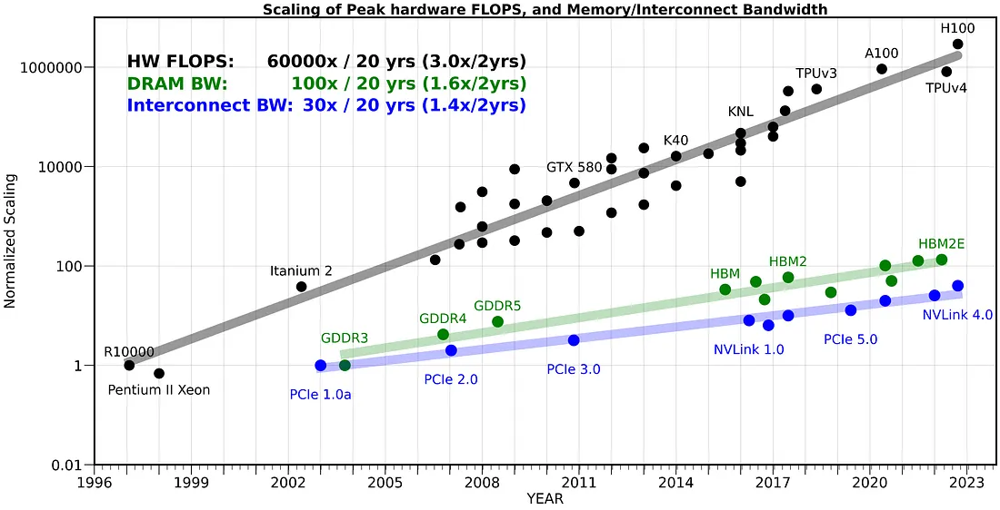

这个系列讲怎么让 Transformer 训练在 GPU 上跑得更快。这一篇先打基础：[第 1 节](#hardware)介绍 GPU 的硬件，包括数据存在哪几层、一个 SM 里有什么、CUDA 的执行层级怎么对应到硬件，最后和 TPU 对照；[第 2 节](#triton)用四个例子介绍 Triton，后面两篇的 kernel 都用它写。

下一篇[谁偷走了 5090 的算力和显存](/blog/gpu-training-analysis/)用这些知识在 RTX 5090 上拆解一步训练的时间和显存，第三篇 [FlashAttention 1–4](/blog/flashattention-1-to-4/) 讲 attention 的 IO-aware kernel。

> 环境：RTX 5090 32 GB，torch 2.11.0+cu130，Triton 3.6.0。

---

## 1 GPU 与 TPU：越靠近计算单元越快 {#hardware}

做性能分析时最常用的两个数是峰值算力和显存带宽。这一节介绍它们背后的硬件：数据在 GPU 里存在哪几层、一个 SM 里有什么、CUDA 的 thread、warp、block 和硬件怎么对应，最后和 TPU 对照一下。

### 1.1 存储层级：越近越快，也越小 {#hw-memory}

处理器的频率早就不怎么涨了，算力的增长主要来自并行：更多的 SM、更宽的 Tensor core。显存带宽的增长比算力慢得多：过去 20 年，峰值算力涨了约 6 万倍（每两年 3.0 倍），DRAM 带宽只涨了约 100 倍（每两年 1.6 倍），芯片之间的互联带宽约 30 倍（[图 1-1](#fig-memwall)）。所以越来越多的 op 落在 roofline 的斜坡上，这是 memory-bound 越来越常见的原因。

<figure id="fig-memwall" class="fg-fig">

<figcaption><strong>图 1-1</strong> 峰值算力与 DRAM、互联带宽 20 年来的增长，纵轴是相对 1997 年的倍数（对数轴）。图来自 Gholami 等人的 <a href="https://arxiv.org/abs/2403.14123">AI and Memory Wall</a>（IEEE Micro，2024）。</figcaption>
</figure>

数据离计算单元越近，读写越快，容量也越小（[图 1-2](#fig-h-1)）。每个 SM 里有寄存器和 L1 / shared memory，所有 SM 共享芯片上的 L2，显存在芯片外面。写 kernel 时，L1 和 L2 由硬件当作 cache 自动管理；能自己安排的只有 shared memory（以及寄存器）。所以 kernel 优化的套路都是一样的：把一块数据从显存读进 shared memory 或寄存器，在片上尽量多算几次，再写回去。[第 2 节](#triton)的分块矩阵乘、[下一篇](/blog/gpu-training-analysis/)里的算子融合和之后的 [FlashAttention](/blog/flashattention-1-to-4/) 都是这个思路。

<figure id="fig-h-1" class="fg-fig">
<svg class="fg" viewBox="0 0 640 300" width="100%" role="img" aria-label="RTX 5090 的存储层级：每个 SM 里有 256 KB 寄存器和 128 KB L1/shared memory，170 个 SM 共享芯片上的 96 MB L2，芯片外是 32 GB GDDR7 显存，带宽 1.79e12 B/s">
  <style>
    .fg .grid { stroke: currentColor; stroke-opacity: .1; }
    .fg .axis { stroke: currentColor; stroke-opacity: .35; }
    .fg .ref { stroke: currentColor; stroke-opacity: .45; stroke-dasharray: 4 4; }
    .fg .tick { font-size: 11px; fill: currentColor; opacity: .65; }
    .fg .lab { font-size: 12px; fill: currentColor; }
    .fg .lab2 { font-size: 11px; fill: currentColor; opacity: .65; }
    .fg .ttl { font-size: 12px; font-weight: 600; fill: currentColor; }
    .fg .val { font-size: 11px; fill: currentColor; }
    .fg .t { font-size: 12.5px; fill: currentColor; }
    .fg .tb { font-size: 12.5px; font-weight: 600; fill: currentColor; }
    .fg .s { font-size: 10.5px; fill: currentColor; opacity: .7; }
    .fg .op { fill: var(--fig-bg); stroke: currentColor; stroke-opacity: .45; stroke-width: 1.2; }
    .fg .band { fill: currentColor; fill-opacity: .045; }
    .fg .ring { stroke: var(--nv-bg, #fff); stroke-width: 2; }
    .fg .halo { fill: none; stroke: var(--nv-bg, #fff); stroke-width: 6px; stroke-linejoin: round; opacity: 1; }
    .fg g.m:hover > :not(title) { opacity: .85; }
    @media (max-width: 640px) { .fg-fig { overflow-x: auto; } .fg-fig > svg { min-width: var(--fg-minw, 540px); } }
  </style>
  <defs><marker id="fig-h-1-m0" viewBox="0 0 8 8" markerUnits="userSpaceOnUse" markerWidth="9" markerHeight="9" refX="7" refY="4" orient="auto"><path d="M0,0 L8,4 L0,8 Z" style="fill: var(--fig-mute)"/></marker></defs>
  <rect x="10" y="22" width="452" height="250" rx="12" style="fill: none; stroke: currentColor" stroke-opacity=".35" stroke-dasharray="6 4"/>
  <text class="lab2" x="22" y="40">GPU 芯片（die），共 170 个 SM</text>
  <rect x="20" y="52" width="92" height="108" rx="8" style="fill: color-mix(in srgb, var(--fig-1) 10%, transparent); stroke: var(--fig-1)" stroke-width="1.4"/>
  <text class="tb" x="66" y="70" text-anchor="middle">SM</text>
  <rect x="28" y="80" width="76" height="32" rx="5" style="fill: color-mix(in srgb, var(--fig-hi) 16%, transparent); stroke: var(--fig-hi)" stroke-width="1.4"/>
  <text class="s" x="66" y="94" text-anchor="middle">寄存器</text><text class="s" x="66" y="107" text-anchor="middle">256 KB</text>
  <rect x="28" y="118" width="76" height="34" rx="5" style="fill: color-mix(in srgb, var(--fig-2) 22%, transparent); stroke: var(--fig-2)" stroke-width="1.4"/>
  <text class="s" x="66" y="132" text-anchor="middle">L1 / shared</text><text class="s" x="66" y="146" text-anchor="middle">128 KB</text>
  <line x1="66.0" y1="160.0" x2="66.0" y2="194.0" stroke="currentColor" stroke-opacity=".6" stroke-width="1.2"/>
  <rect x="120" y="52" width="92" height="108" rx="8" style="fill: color-mix(in srgb, var(--fig-1) 10%, transparent); stroke: var(--fig-1)" stroke-width="1.4"/>
  <text class="tb" x="166" y="70" text-anchor="middle">SM</text>
  <rect x="128" y="80" width="76" height="32" rx="5" style="fill: color-mix(in srgb, var(--fig-hi) 16%, transparent); stroke: var(--fig-hi)" stroke-width="1.4"/>
  <text class="s" x="166" y="94" text-anchor="middle">寄存器</text><text class="s" x="166" y="107" text-anchor="middle">256 KB</text>
  <rect x="128" y="118" width="76" height="34" rx="5" style="fill: color-mix(in srgb, var(--fig-2) 22%, transparent); stroke: var(--fig-2)" stroke-width="1.4"/>
  <text class="s" x="166" y="132" text-anchor="middle">L1 / shared</text><text class="s" x="166" y="146" text-anchor="middle">128 KB</text>
  <line x1="166.0" y1="160.0" x2="166.0" y2="194.0" stroke="currentColor" stroke-opacity=".6" stroke-width="1.2"/>
  <rect x="220" y="52" width="92" height="108" rx="8" style="fill: color-mix(in srgb, var(--fig-1) 10%, transparent); stroke: var(--fig-1)" stroke-width="1.4"/>
  <text class="tb" x="266" y="70" text-anchor="middle">SM</text>
  <rect x="228" y="80" width="76" height="32" rx="5" style="fill: color-mix(in srgb, var(--fig-hi) 16%, transparent); stroke: var(--fig-hi)" stroke-width="1.4"/>
  <text class="s" x="266" y="94" text-anchor="middle">寄存器</text><text class="s" x="266" y="107" text-anchor="middle">256 KB</text>
  <rect x="228" y="118" width="76" height="34" rx="5" style="fill: color-mix(in srgb, var(--fig-2) 22%, transparent); stroke: var(--fig-2)" stroke-width="1.4"/>
  <text class="s" x="266" y="132" text-anchor="middle">L1 / shared</text><text class="s" x="266" y="146" text-anchor="middle">128 KB</text>
  <line x1="266.0" y1="160.0" x2="266.0" y2="194.0" stroke="currentColor" stroke-opacity=".6" stroke-width="1.2"/>
  <text class="t" x="339" y="110" text-anchor="middle">⋯</text>
  <rect x="360" y="52" width="92" height="108" rx="8" style="fill: color-mix(in srgb, var(--fig-1) 10%, transparent); stroke: var(--fig-1)" stroke-width="1.4"/>
  <text class="tb" x="406" y="70" text-anchor="middle">SM</text>
  <rect x="368" y="80" width="76" height="32" rx="5" style="fill: color-mix(in srgb, var(--fig-hi) 16%, transparent); stroke: var(--fig-hi)" stroke-width="1.4"/>
  <text class="s" x="406" y="94" text-anchor="middle">寄存器</text><text class="s" x="406" y="107" text-anchor="middle">256 KB</text>
  <rect x="368" y="118" width="76" height="34" rx="5" style="fill: color-mix(in srgb, var(--fig-2) 22%, transparent); stroke: var(--fig-2)" stroke-width="1.4"/>
  <text class="s" x="406" y="132" text-anchor="middle">L1 / shared</text><text class="s" x="406" y="146" text-anchor="middle">128 KB</text>
  <line x1="406.0" y1="160.0" x2="406.0" y2="194.0" stroke="currentColor" stroke-opacity=".6" stroke-width="1.2"/>
  <rect x="24" y="194" width="426" height="40" rx="8" style="fill: color-mix(in srgb, var(--fig-3) 45%, transparent); stroke: var(--fig-2)" stroke-width="1.4"/>
  <text class="t" x="237" y="219" text-anchor="middle">L2 cache 96 MB，所有 SM 共享</text>
  <text class="lab2" x="237" y="258" text-anchor="middle">片上</text>
  <rect x="504" y="70" width="124" height="150" rx="10" style="fill: color-mix(in srgb, var(--fig-mute) 14%, transparent); stroke: var(--fig-mute)" stroke-width="1.4"/>
  <text class="tb" x="566" y="124" text-anchor="middle">GDDR7 显存</text><text class="t" x="566" y="144" text-anchor="middle">32 GB</text><text class="s" x="566" y="168" text-anchor="middle">带宽 β</text><text class="s" x="566" y="182" text-anchor="middle">1.79e12 B/s</text>
  <text class="lab2" x="566" y="238" text-anchor="middle">片外</text>
  <line x1="452.0" y1="214.0" x2="500.0" y2="214.0" style="stroke: var(--fig-mute)" stroke-width="1.8" marker-end="url(#fig-h-1-m0)"/>
  <line x1="500.0" y1="200.0" x2="452.0" y2="200.0" style="stroke: var(--fig-mute)" stroke-width="1.8" marker-end="url(#fig-h-1-m0)"/>
  <text class="lab2" x="10" y="292">越靠近 SM 越快、越小：寄存器 > L1 / shared > L2 > 显存</text>
</svg>
<figcaption><strong>图 1-2</strong> RTX 5090 的存储层级示意。规格来自 <a href="https://images.nvidia.com/aem-dam/Solutions/geforce/blackwell/nvidia-rtx-blackwell-gpu-architecture.pdf">NVIDIA RTX Blackwell 白皮书</a>，官方的整芯片和 SM 结构图也在白皮书里。</figcaption>
</figure>

5090 是消费级显卡，显存用的是 GDDR7（32 GB，512-bit，28 Gbps，带宽 1,792 GB/s），不是数据中心卡上的 HBM，也没有 ECC 和 NVLink。

### 1.2 一个 SM 里有什么 {#hw-sm}

每个 SM 分成 4 个 SMSP（SM sub-partition），每个 SMSP 有自己的 warp 调度器、寄存器、FP32 运算单元和一个 Tensor core，4 个 SMSP 共享一块 L1 / shared memory（[图 1-3](#fig-h-2)）。几代 GPU 的规格对比见[表 1-1](#tab-1-1)。

<figure id="fig-h-2" class="fg-fig">
<svg class="fg" viewBox="0 0 640 300" width="100%" role="img" aria-label="RTX 5090 的一个 SM：4 个 SMSP，每个有 1 个 warp 调度器、12 个 warp 槽位、64 KB 寄存器、32 条 FP32 lane 和 1 个 Tensor core；4 个 SMSP 共享 128 KB 的 L1/shared memory">
  <style>
    .fg .grid { stroke: currentColor; stroke-opacity: .1; }
    .fg .axis { stroke: currentColor; stroke-opacity: .35; }
    .fg .ref { stroke: currentColor; stroke-opacity: .45; stroke-dasharray: 4 4; }
    .fg .tick { font-size: 11px; fill: currentColor; opacity: .65; }
    .fg .lab { font-size: 12px; fill: currentColor; }
    .fg .lab2 { font-size: 11px; fill: currentColor; opacity: .65; }
    .fg .ttl { font-size: 12px; font-weight: 600; fill: currentColor; }
    .fg .val { font-size: 11px; fill: currentColor; }
    .fg .t { font-size: 12.5px; fill: currentColor; }
    .fg .tb { font-size: 12.5px; font-weight: 600; fill: currentColor; }
    .fg .s { font-size: 10.5px; fill: currentColor; opacity: .7; }
    .fg .op { fill: var(--fig-bg); stroke: currentColor; stroke-opacity: .45; stroke-width: 1.2; }
    .fg .band { fill: currentColor; fill-opacity: .045; }
    .fg .ring { stroke: var(--nv-bg, #fff); stroke-width: 2; }
    .fg .halo { fill: none; stroke: var(--nv-bg, #fff); stroke-width: 6px; stroke-linejoin: round; opacity: 1; }
    .fg g.m:hover > :not(title) { opacity: .85; }
    @media (max-width: 640px) { .fg-fig { overflow-x: auto; } .fg-fig > svg { min-width: var(--fg-minw, 540px); } }
  </style>
  <rect x="10" y="10" width="620" height="282" rx="12" style="fill: color-mix(in srgb, var(--fig-1) 6%, transparent); stroke: var(--fig-1)" stroke-width="1.4"/>
  <text class="tb" x="24" y="32">SM（每颗 5090 有 170 个）</text>
  <rect x="24" y="44" width="141" height="188" rx="8" class="op"/>
  <text class="tb" x="94" y="62" text-anchor="middle">SMSP 0</text>
  <rect x="34" y="70" width="121" height="22" rx="4" style="fill: color-mix(in srgb, var(--fig-1) 10%, transparent); stroke: var(--fig-1)" stroke-width="1.4"/>
  <text class="s" x="94" y="85" text-anchor="middle">warp 调度器</text>
  <text class="s" x="94" y="108" text-anchor="middle">warp 槽位 ×12</text>
  <rect x="35" y="114" width="17" height="10" rx="2" style="fill: var(--fig-1)"/>
  <rect x="55" y="114" width="17" height="10" rx="2" style="fill: var(--fig-1)"/>
  <rect x="75" y="114" width="17" height="10" rx="2" style="fill: var(--fig-1)"/>
  <rect x="95" y="114" width="17" height="10" rx="2" style="fill: none; stroke: var(--fig-1)" stroke-opacity=".55"/>
  <rect x="115" y="114" width="17" height="10" rx="2" style="fill: none; stroke: var(--fig-1)" stroke-opacity=".55"/>
  <rect x="135" y="114" width="17" height="10" rx="2" style="fill: none; stroke: var(--fig-1)" stroke-opacity=".55"/>
  <rect x="35" y="128" width="17" height="10" rx="2" style="fill: none; stroke: var(--fig-1)" stroke-opacity=".55"/>
  <rect x="55" y="128" width="17" height="10" rx="2" style="fill: none; stroke: var(--fig-1)" stroke-opacity=".55"/>
  <rect x="75" y="128" width="17" height="10" rx="2" style="fill: none; stroke: var(--fig-1)" stroke-opacity=".55"/>
  <rect x="95" y="128" width="17" height="10" rx="2" style="fill: none; stroke: var(--fig-1)" stroke-opacity=".55"/>
  <rect x="115" y="128" width="17" height="10" rx="2" style="fill: none; stroke: var(--fig-1)" stroke-opacity=".55"/>
  <rect x="135" y="128" width="17" height="10" rx="2" style="fill: none; stroke: var(--fig-1)" stroke-opacity=".55"/>
  <rect x="34" y="146" width="121" height="22" rx="4" style="fill: color-mix(in srgb, var(--fig-hi) 16%, transparent); stroke: var(--fig-hi)" stroke-width="1.4"/>
  <text class="s" x="94" y="161" text-anchor="middle">寄存器 64 KB</text>
  <rect x="34" y="173" width="121" height="22" rx="4" style="fill: color-mix(in srgb, var(--fig-2) 22%, transparent); stroke: var(--fig-2)" stroke-width="1.4"/>
  <text class="s" x="94" y="188" text-anchor="middle">32 条 FP32 lane</text>
  <rect x="34" y="200" width="121" height="22" rx="4" style="fill: color-mix(in srgb, var(--fig-1) 22%, transparent); stroke: var(--fig-1)" stroke-width="1.4"/>
  <text class="s" x="94" y="215" text-anchor="middle">Tensor core ×1</text>
  <rect x="175" y="44" width="141" height="188" rx="8" class="op"/>
  <text class="tb" x="245" y="62" text-anchor="middle">SMSP 1</text>
  <rect x="185" y="70" width="121" height="22" rx="4" style="fill: color-mix(in srgb, var(--fig-1) 10%, transparent); stroke: var(--fig-1)" stroke-width="1.4"/>
  <text class="s" x="245" y="85" text-anchor="middle">warp 调度器</text>
  <text class="s" x="245" y="108" text-anchor="middle">warp 槽位 ×12</text>
  <rect x="186" y="114" width="17" height="10" rx="2" style="fill: var(--fig-1)"/>
  <rect x="206" y="114" width="17" height="10" rx="2" style="fill: var(--fig-1)"/>
  <rect x="226" y="114" width="17" height="10" rx="2" style="fill: var(--fig-1)"/>
  <rect x="246" y="114" width="17" height="10" rx="2" style="fill: none; stroke: var(--fig-1)" stroke-opacity=".55"/>
  <rect x="266" y="114" width="17" height="10" rx="2" style="fill: none; stroke: var(--fig-1)" stroke-opacity=".55"/>
  <rect x="286" y="114" width="17" height="10" rx="2" style="fill: none; stroke: var(--fig-1)" stroke-opacity=".55"/>
  <rect x="186" y="128" width="17" height="10" rx="2" style="fill: none; stroke: var(--fig-1)" stroke-opacity=".55"/>
  <rect x="206" y="128" width="17" height="10" rx="2" style="fill: none; stroke: var(--fig-1)" stroke-opacity=".55"/>
  <rect x="226" y="128" width="17" height="10" rx="2" style="fill: none; stroke: var(--fig-1)" stroke-opacity=".55"/>
  <rect x="246" y="128" width="17" height="10" rx="2" style="fill: none; stroke: var(--fig-1)" stroke-opacity=".55"/>
  <rect x="266" y="128" width="17" height="10" rx="2" style="fill: none; stroke: var(--fig-1)" stroke-opacity=".55"/>
  <rect x="286" y="128" width="17" height="10" rx="2" style="fill: none; stroke: var(--fig-1)" stroke-opacity=".55"/>
  <rect x="185" y="146" width="121" height="22" rx="4" style="fill: color-mix(in srgb, var(--fig-hi) 16%, transparent); stroke: var(--fig-hi)" stroke-width="1.4"/>
  <text class="s" x="245" y="161" text-anchor="middle">寄存器 64 KB</text>
  <rect x="185" y="173" width="121" height="22" rx="4" style="fill: color-mix(in srgb, var(--fig-2) 22%, transparent); stroke: var(--fig-2)" stroke-width="1.4"/>
  <text class="s" x="245" y="188" text-anchor="middle">32 条 FP32 lane</text>
  <rect x="185" y="200" width="121" height="22" rx="4" style="fill: color-mix(in srgb, var(--fig-1) 22%, transparent); stroke: var(--fig-1)" stroke-width="1.4"/>
  <text class="s" x="245" y="215" text-anchor="middle">Tensor core ×1</text>
  <rect x="326" y="44" width="141" height="188" rx="8" class="op"/>
  <text class="tb" x="396" y="62" text-anchor="middle">SMSP 2</text>
  <rect x="336" y="70" width="121" height="22" rx="4" style="fill: color-mix(in srgb, var(--fig-1) 10%, transparent); stroke: var(--fig-1)" stroke-width="1.4"/>
  <text class="s" x="396" y="85" text-anchor="middle">warp 调度器</text>
  <text class="s" x="396" y="108" text-anchor="middle">warp 槽位 ×12</text>
  <rect x="337" y="114" width="17" height="10" rx="2" style="fill: var(--fig-1)"/>
  <rect x="357" y="114" width="17" height="10" rx="2" style="fill: var(--fig-1)"/>
  <rect x="377" y="114" width="17" height="10" rx="2" style="fill: var(--fig-1)"/>
  <rect x="397" y="114" width="17" height="10" rx="2" style="fill: none; stroke: var(--fig-1)" stroke-opacity=".55"/>
  <rect x="417" y="114" width="17" height="10" rx="2" style="fill: none; stroke: var(--fig-1)" stroke-opacity=".55"/>
  <rect x="437" y="114" width="17" height="10" rx="2" style="fill: none; stroke: var(--fig-1)" stroke-opacity=".55"/>
  <rect x="337" y="128" width="17" height="10" rx="2" style="fill: none; stroke: var(--fig-1)" stroke-opacity=".55"/>
  <rect x="357" y="128" width="17" height="10" rx="2" style="fill: none; stroke: var(--fig-1)" stroke-opacity=".55"/>
  <rect x="377" y="128" width="17" height="10" rx="2" style="fill: none; stroke: var(--fig-1)" stroke-opacity=".55"/>
  <rect x="397" y="128" width="17" height="10" rx="2" style="fill: none; stroke: var(--fig-1)" stroke-opacity=".55"/>
  <rect x="417" y="128" width="17" height="10" rx="2" style="fill: none; stroke: var(--fig-1)" stroke-opacity=".55"/>
  <rect x="437" y="128" width="17" height="10" rx="2" style="fill: none; stroke: var(--fig-1)" stroke-opacity=".55"/>
  <rect x="336" y="146" width="121" height="22" rx="4" style="fill: color-mix(in srgb, var(--fig-hi) 16%, transparent); stroke: var(--fig-hi)" stroke-width="1.4"/>
  <text class="s" x="396" y="161" text-anchor="middle">寄存器 64 KB</text>
  <rect x="336" y="173" width="121" height="22" rx="4" style="fill: color-mix(in srgb, var(--fig-2) 22%, transparent); stroke: var(--fig-2)" stroke-width="1.4"/>
  <text class="s" x="396" y="188" text-anchor="middle">32 条 FP32 lane</text>
  <rect x="336" y="200" width="121" height="22" rx="4" style="fill: color-mix(in srgb, var(--fig-1) 22%, transparent); stroke: var(--fig-1)" stroke-width="1.4"/>
  <text class="s" x="396" y="215" text-anchor="middle">Tensor core ×1</text>
  <rect x="477" y="44" width="141" height="188" rx="8" class="op"/>
  <text class="tb" x="547" y="62" text-anchor="middle">SMSP 3</text>
  <rect x="487" y="70" width="121" height="22" rx="4" style="fill: color-mix(in srgb, var(--fig-1) 10%, transparent); stroke: var(--fig-1)" stroke-width="1.4"/>
  <text class="s" x="547" y="85" text-anchor="middle">warp 调度器</text>
  <text class="s" x="547" y="108" text-anchor="middle">warp 槽位 ×12</text>
  <rect x="488" y="114" width="17" height="10" rx="2" style="fill: var(--fig-1)"/>
  <rect x="508" y="114" width="17" height="10" rx="2" style="fill: var(--fig-1)"/>
  <rect x="528" y="114" width="17" height="10" rx="2" style="fill: var(--fig-1)"/>
  <rect x="548" y="114" width="17" height="10" rx="2" style="fill: none; stroke: var(--fig-1)" stroke-opacity=".55"/>
  <rect x="568" y="114" width="17" height="10" rx="2" style="fill: none; stroke: var(--fig-1)" stroke-opacity=".55"/>
  <rect x="588" y="114" width="17" height="10" rx="2" style="fill: none; stroke: var(--fig-1)" stroke-opacity=".55"/>
  <rect x="488" y="128" width="17" height="10" rx="2" style="fill: none; stroke: var(--fig-1)" stroke-opacity=".55"/>
  <rect x="508" y="128" width="17" height="10" rx="2" style="fill: none; stroke: var(--fig-1)" stroke-opacity=".55"/>
  <rect x="528" y="128" width="17" height="10" rx="2" style="fill: none; stroke: var(--fig-1)" stroke-opacity=".55"/>
  <rect x="548" y="128" width="17" height="10" rx="2" style="fill: none; stroke: var(--fig-1)" stroke-opacity=".55"/>
  <rect x="568" y="128" width="17" height="10" rx="2" style="fill: none; stroke: var(--fig-1)" stroke-opacity=".55"/>
  <rect x="588" y="128" width="17" height="10" rx="2" style="fill: none; stroke: var(--fig-1)" stroke-opacity=".55"/>
  <rect x="487" y="146" width="121" height="22" rx="4" style="fill: color-mix(in srgb, var(--fig-hi) 16%, transparent); stroke: var(--fig-hi)" stroke-width="1.4"/>
  <text class="s" x="547" y="161" text-anchor="middle">寄存器 64 KB</text>
  <rect x="487" y="173" width="121" height="22" rx="4" style="fill: color-mix(in srgb, var(--fig-2) 22%, transparent); stroke: var(--fig-2)" stroke-width="1.4"/>
  <text class="s" x="547" y="188" text-anchor="middle">32 条 FP32 lane</text>
  <rect x="487" y="200" width="121" height="22" rx="4" style="fill: color-mix(in srgb, var(--fig-1) 22%, transparent); stroke: var(--fig-1)" stroke-width="1.4"/>
  <text class="s" x="547" y="215" text-anchor="middle">Tensor core ×1</text>
  <rect x="24" y="242" width="594" height="38" rx="8" style="fill: color-mix(in srgb, var(--fig-2) 22%, transparent); stroke: var(--fig-2)" stroke-width="1.4"/>
  <text class="t" x="321" y="266" text-anchor="middle">L1 cache / shared memory 128 KB（4 个 SMSP 共享，shared memory 的大小由 kernel 申请）</text>
</svg>
<figcaption><strong>图 1-3</strong> RTX 5090 一个 SM 的结构示意（SMSP 即 SM sub-partition）。每个 SMSP 有 12 个 warp 槽位，整个 SM 共 48 个；实心的 3 个对应 1.2 节 occupancy 25% 的例子。</figcaption>
</figure>

| | A100 | H100 | B200 | RTX 5090 |
|:--|--:|--:|--:|--:|
| SM 数 | 108 | 132 | 148 | 170 |
| L2 | 40 MB | 50 MB | — | 96 MB |
| 显存 | 80 GB HBM2e | 80 GB HBM3 | 192 GB HBM3e | 32 GB GDDR7 |
| 显存带宽 | 2.0e12 B/s | 3.35e12 B/s | 8e12 B/s | 1.79e12 B/s |
| 每 SM 的 FP32 单元 | 64 | 128 | 128 | 128 |
| 每 SM 的 Tensor core | 4 | 4 | 4 | 4 |
| 每 SM 的 L1 + shared | 192 KB | 256 KB | 256 KB | 128 KB |
| 每 SM 的寄存器 | 256 KB | 256 KB | 256 KB | 256 KB |
| 每 SM 最多驻留 warp | 64 | 64 | 64 | 48 |
{#tab-1-1 caption="**表 1-1** 几代 NVIDIA GPU 的规格" note="来自 NVIDIA 各代架构白皮书和产品规格（A100 80GB SXM，H100 SXM）。B200 的 L2 没有找到可靠的公开数字，暂缺。"}

GPU 靠同时驻留很多 warp 来掩盖访存延迟：一个 warp 等显存数据（几百个周期）时，调度器切到另一个已经就绪的 warp 去算。切换几乎没有代价，因为驻留的 warp 的寄存器同时都在寄存器堆里，不需要换进换出。每个 SM 能驻留多少 warp，硬件有上限（5090 是 48，A100、H100 是 64）；一个 kernel 实际能驻留多少，还要看它每个线程用多少寄存器、每个 block 用多少 shared memory。驻留 warp 数占上限的比例叫 occupancy。例如每个 block 128 个线程、每个线程用 160 个寄存器：

```python
regs_per_sm     = 256 * 1024 // 4               # 65536 个 32 位寄存器
regs_per_block  = 128 * 160                     # 20480
blocks_per_sm   = regs_per_sm // regs_per_block # 3，受寄存器限制
warps_per_sm    = blocks_per_sm * 128 // 32     # 12
occupancy_h100  = warps_per_sm / 64             # 0.1875
occupancy_5090  = warps_per_sm / 48             # 0.25
```

[图 1-3](#fig-h-2) 里每个 SMSP 的 12 个槽位只占了 3 个，就是这个例子。occupancy 不需要占满。只要驻留的 warp 足够把访存延迟藏起来，再多也不会更快；矩阵乘这类 kernel 常常故意让每个线程用很多寄存器，换取更高的数据复用。

### 1.3 编程模型：thread、warp、block、grid {#hw-model}

CUDA 的执行模型叫 SIMT（single instruction, multiple threads）：同一个 warp 里的 32 个线程在同一时刻执行同一条指令。各层级和硬件的对应见[表 1-2](#tab-1-2)。

| 层级 | 是什么 | 对应的硬件 | 作用 |
|:--|:--|:--|:--|
| thread | 最基本的执行单元 | 一条 lane | 执行自己的标量指令序列 |
| warp | 调度的基本单位，32 个线程 | 由一个 SMSP 的调度器调度 | 32 个线程同时执行同一条指令 |
| block（CTA） | 一组线程，例如 8 个 warp | 整个驻留在一个 SM 上，不会跨 SM | 共享同一块 shared memory，块内可以同步，是分块计算的单位 |
| grid | 一次 kernel 启动的全部 block | 整张 GPU | block 之间互相独立，由硬件分配到各个 SM |
{#tab-1-2 caption="**表 1-2** CUDA 的执行层级"}

block 之间不能直接共享数据，只能通过显存交换，而这正是最慢的一层。所以要尽量把会重复读的数据放进同一个 block 里处理，这就是分块（tiling）。

### 1.4 TPU：更大的矩阵单元，更简单的控制 {#hw-tpu}

TPU 的思路是把控制逻辑做轻，把矩阵乘单元做大：没有 warp，只有更大的块，更适合矩阵乘。和 GPU 的另一个大区别在多卡之间怎么互联，这超出了本文的范围。两边术语的对应见[表 1-3](#tab-1-3)。

| GPU | TPU | 作用 | H100 | TPU v5p |
|:--|:--|:--|--:|--:|
| SM | TensorCore | 包含其他运算单元的核心 | 132 | 2 |
| warp 调度器 | VPU | SIMD 向量运算的调度 | 528 | 8 |
| CUDA core | VPU ALU | 普通的 SIMD 运算单元 | — | — |
| L1 / shared memory | VMEM | 片上的快速存储 | 33 MB | 128 MB |
| 寄存器 | VREG | 向量寄存器 | 33 MB | 256 KB |
| Tensor core | MXU | 矩阵乘单元 | 528 | 8 |
| 显存（HBM） | HBM | 大容量主存 | 80 GB | 95 GB |
{#tab-1-3 caption="**表 1-3** GPU 与 TPU 的术语对照" note="H100 的片上存储是 132 个 SM 加起来的总量。TPU 一列参考 Google 的 <a href=\"https://jax-ml.github.io/scaling-book/gpus/\">How to Scale Your Model</a>。"}

---

## 2 Triton：按 block 写 kernel {#triton}

[下一篇](/blog/gpu-training-analysis/#rmsnorm)手写的融合 RMSNorm 和之后的 [FlashAttention](/blog/flashattention-1-to-4/) 都用 Triton 写。这一节用四个例子介绍它：逐元素的 GELU，一行一个 program 的 softmax，行太长时分块累加的 row sum，以及分块乘加的矩阵乘。代码都在 RTX 5090 上和 PyTorch 对照过。

CUDA 要写清楚每个线程做什么，控制最细，但 shared memory、线程同步这些都要自己管。Triton 只要写清楚每个线程块做什么：把一块数据读进来，在片上算完，再写回显存，块内怎么分给线程、要不要经过 shared memory 由编译器决定。Triton 把一个线程块叫作一个 program，概念对应见[表 2-1](#tab-2-1)。

| CUDA | Triton | 写法 | 能否直接控制 |
|:--|:--|:--|:--|
| thread | 不暴露 | 写不到 `threadIdx` | 不能 |
| warp | 只给数量 | 启动时传 `num_warps=N`，默认 4 | 只能调数量 |
| block（CTA） | program | `@triton.jit` 函数体就是一个 program 的代码；`tl.program_id(axis)` ≈ `blockIdx`，`tl.num_programs(axis)` ≈ `gridDim` | 主要的编程层 |
| grid | grid | `kernel[grid](...)`，例如 `grid = (triton.cdiv(n, BLOCK),)` | 自己定 |
| shared memory | 由编译器分配 | 没有对应语句 | 不能 |
{#tab-2-1 caption="**表 2-1** CUDA 概念在 Triton 里的对应"}

### 2.1 GELU：逐元素 kernel {#triton-gelu}

逐元素 op 最简单：把 n 个元素切成每段 BLOCK 个，一段交给一个 program。kernel 里先用 `tl.program_id` 算出自己负责的下标，读进来，算完写回：

```python
@triton.jit
def gelu_kernel(x_ptr, y_ptr, n, BLOCK: tl.constexpr):
    pid = tl.program_id(axis=0)               # 第几个 program（≈ CUDA 的 blockIdx.x）
    offsets = pid * BLOCK + tl.arange(0, BLOCK)  # 这个 program 负责的 BLOCK 个下标
    mask = offsets < n                        # 最后一个 program 可能越界
    x = tl.load(x_ptr + offsets, mask=mask)   # 从显存读到寄存器
    # tanh 近似：0.5·x·(1 + tanh(√(2/π)·(x + 0.044715·x³)))，tanh(a) = (e^{2a} − 1)/(e^{2a} + 1)
    a = 0.79788456 * (x + 0.044715 * x * x * x)
    e = tl.exp(2 * a)
    y = 0.5 * x * (1 + (e - 1) / (e + 1))
    tl.store(y_ptr + offsets, y, mask=mask)   # 写回显存
```

启动时只要定 grid，也就是 program 的个数。program 个数和 SM 个数无关：5090 有 170 个 SM，program 多于 SM 时，GPU 会一批一批地调度。

```python
def gelu(x):
    y = torch.empty_like(x)
    n, BLOCK = x.numel(), 1024                # 每个 program 处理 1024 个元素
    grid = (triton.cdiv(n, BLOCK),)           # program 个数，不是 SM 个数
    gelu_kernel[grid](x, y, n, BLOCK=BLOCK)
    return y
```

Triton 会把 kernel 编译成 PTX，PTX 描述的是单个线程的指令。下面是 GELU 的 PTX 节选：

```
mov.u32        %r17, %ctaid.x;                // program 编号，即 blockIdx.x
mov.u32        %r20, %tid.x;                  // 线程编号
@%p1 ld.global.b32 { %r1 }, [ %rd1 + 0 ];     // 读显存，%p1 是 mask 算出的谓词
...                                           // 一共 8 条 ld.global
ex2.approx.f32 %r72, %r71;                    // tl.exp 编成以 2 为底的指数
@%p1 st.global.b32 [ %rd9 + 0 ], { %r9 };     // 写回显存
```

一个 program 处理 1024 个元素，默认 4 个 warp 共 128 个线程，所以每个线程分到 8 个元素，PTX 里正好是 8 条 `ld.global` 和 8 条 `st.global`。

### 2.2 Softmax：一行一个 program {#triton-softmax}

按行做的 softmax 在 eager 下要 5 个 kernel，和[下一篇](/blog/gpu-training-analysis/#attention)里 attention 的 softmax 一样。对 `[M, N]` 的输入，一共读 5MN + 2M 个数，写 3MN + 2M 个：

```python
def softmax_naive(x):                         # x: [M, N]，按行
    m = x.max(dim=1, keepdim=True).values     # 读 MN，写 M
    z = x - m                                 # 读 MN + M，写 MN
    e = torch.exp(z)                          # 读 MN，写 MN
    s = e.sum(dim=1, keepdim=True)            # 读 MN，写 M
    return e / s                              # 读 MN + M，写 MN
```

如果一个 program 处理一整行，max、exp、求和、除都可以在寄存器里做完，只读 MN、写 MN，读写量是原来的 1/4：

```python
@triton.jit
def softmax_kernel(x_ptr, y_ptr, stride, N, BLOCK: tl.constexpr):
    row = tl.program_id(0)                    # 一个 program 处理一整行
    cols = tl.arange(0, BLOCK)                # BLOCK ≥ N，一次装下整行
    x = tl.load(x_ptr + row * stride + cols, mask=cols < N, other=float("-inf"))
    x = x - tl.max(x, axis=0)                 # 以下全在寄存器里
    e = tl.exp(x)
    y = e / tl.sum(e, axis=0)
    tl.store(y_ptr + row * stride + cols, y, mask=cols < N)

def softmax(x):
    M, N = x.shape
    y = torch.empty_like(x)
    softmax_kernel[(M,)](x, y, x.stride(0), N, BLOCK=triton.next_power_of_2(N))
    return y
```

在 5090 上对 4096 × 4096 的 fp32 输入实测，eager 版 249 µs，Triton 版 80 µs，快了 3.1 倍，和 `torch.softmax`（79 µs）相当。

这个写法要求 BLOCK ≥ N，也就是一行能一次装进一个 program。行再长就要像下一节那样分块读。

### 2.3 Row sum：行太长时分块累加 {#triton-rowsum}

求和可以分块：program 沿着行一块一块读，每块 TILE 个数加到一个长度为 TILE 的部分和向量上，最后再把这个向量加成一个数。循环里每个位置各加各的，不需要线程之间通信；只有最后的 `tl.sum` 做一次跨线程归约。

```python
@triton.jit
def row_sum_kernel(x_ptr, out_ptr, N, TILE: tl.constexpr):
    row = tl.program_id(0)
    acc = tl.zeros([TILE], dtype=tl.float32)  # TILE 路部分和，不是一个标量
    for start in range(0, N, TILE):           # 行比 TILE 长：一块一块串行读
        cols = start + tl.arange(0, TILE)
        acc += tl.load(x_ptr + row * N + cols, mask=cols < N, other=0.0)
    tl.store(out_ptr + row, tl.sum(acc, axis=0))  # 最后只做一次跨线程归约

def row_sum(x, TILE=1024):
    M, N = x.shape
    out = torch.empty(M, device=x.device, dtype=x.dtype)
    row_sum_kernel[(M,)](x, out, N, TILE=TILE)
    return out
```

softmax 不能直接这样分块：要先知道整行的最大值才能算 exp，而最大值要读完整行才知道。边读边更新最大值、同时修正已经算好的部分和，就是 online softmax，[FlashAttention](/blog/flashattention-1-to-4/) 那篇会讲。

### 2.4 Matmul：分块乘加，顺手融合 ReLU {#triton-matmul}

矩阵乘按输出 C 分块，一个 program 负责 C 的一个 BM × BN 块，grid 是二维的。program 沿 K 方向每次读 A 的一个 BM × BK 块和 B 的一个 BK × BN 块，用 `tl.dot` 乘加到累加器上。写回之前在寄存器里做 ReLU，激活函数就不需要单独一个 kernel 再读写一遍 C：

```python
@triton.jit
def matmul_relu_kernel(a_ptr, b_ptr, c_ptr, M, N, K,
                       sam, sak, sbk, sbn, scm, scn,
                       BM: tl.constexpr, BN: tl.constexpr, BK: tl.constexpr):
    pid_m, pid_n = tl.program_id(0), tl.program_id(1)   # 负责 C 的第 (pid_m, pid_n) 块
    rm = pid_m * BM + tl.arange(0, BM)
    rn = pid_n * BN + tl.arange(0, BN)
    rk = tl.arange(0, BK)
    a_ptrs = a_ptr + rm[:, None] * sam + rk[None, :] * sak  # [BM, BK] 的指针
    b_ptrs = b_ptr + rk[:, None] * sbk + rn[None, :] * sbn  # [BK, BN] 的指针
    acc = tl.zeros([BM, BN], dtype=tl.float32)
    for k in range(0, K, BK):                 # 沿 K 一块一块乘加
        a = tl.load(a_ptrs, mask=(rm[:, None] < M) & (rk[None, :] + k < K), other=0.0)
        b = tl.load(b_ptrs, mask=(rk[:, None] + k < K) & (rn[None, :] < N), other=0.0)
        acc += tl.dot(a, b, input_precision="ieee")  # fp32 默认会走 tf32，这里要求精确的 fp32
        a_ptrs += BK * sak
        b_ptrs += BK * sbk
    acc = tl.maximum(acc, 0.0)                # ReLU 在寄存器里做完，不多一次读写
    c_ptrs = c_ptr + rm[:, None] * scm + rn[None, :] * scn
    tl.store(c_ptrs, acc, mask=(rm[:, None] < M) & (rn[None, :] < N))

def matmul_relu(a, b, BM=64, BN=64, BK=32):
    M, K = a.shape
    _, N = b.shape
    c = torch.empty((M, N), device=a.device, dtype=torch.float32)
    grid = (triton.cdiv(M, BM), triton.cdiv(N, BN))
    matmul_relu_kernel[grid](a, b, c, M, N, K, *a.stride(), *b.stride(), *c.stride(), BM=BM, BN=BN, BK=BK)
    return c
```

fp32 输入时 `tl.dot` 默认走 tf32 的 Tensor core，结果和 fp32 的矩阵乘差 0.1 左右；要和 PyTorch（关掉 tf32）对上，需要 `input_precision="ieee"`。
